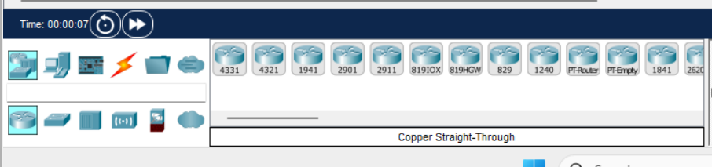
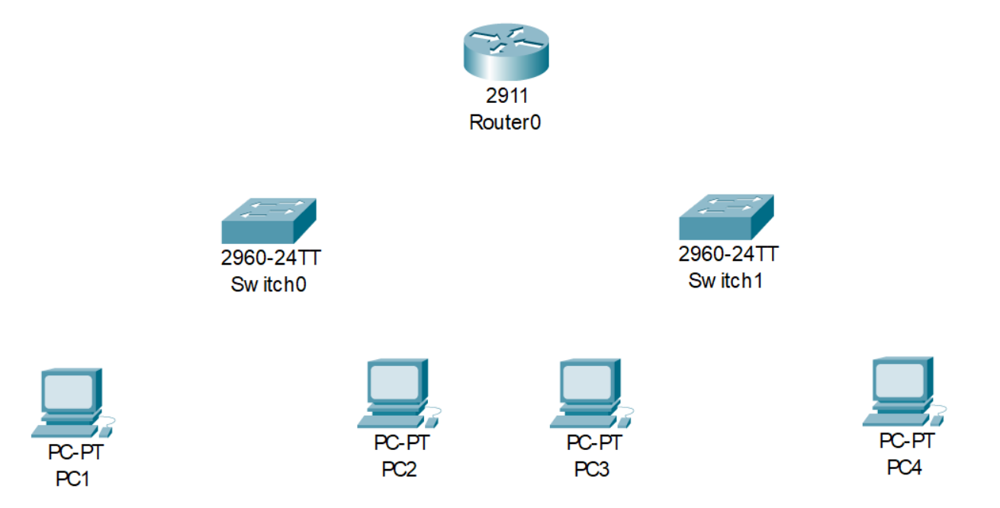
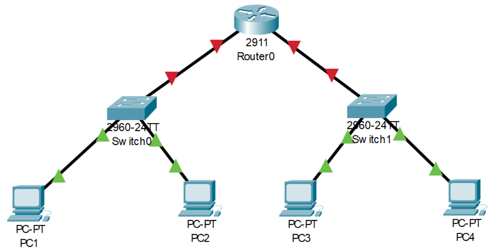
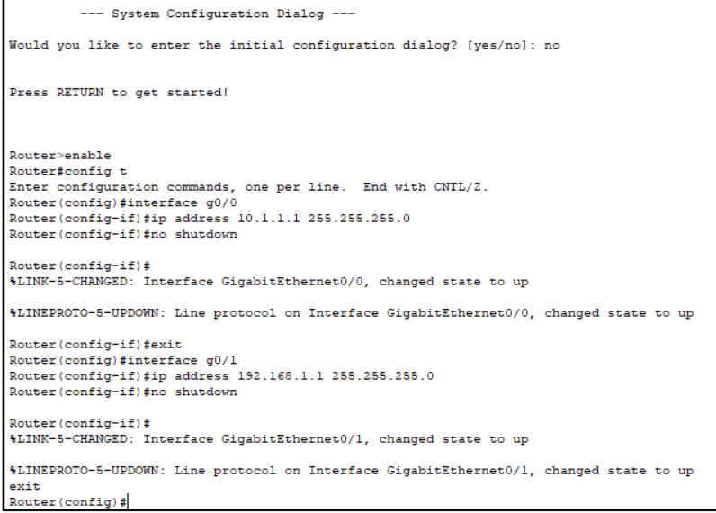
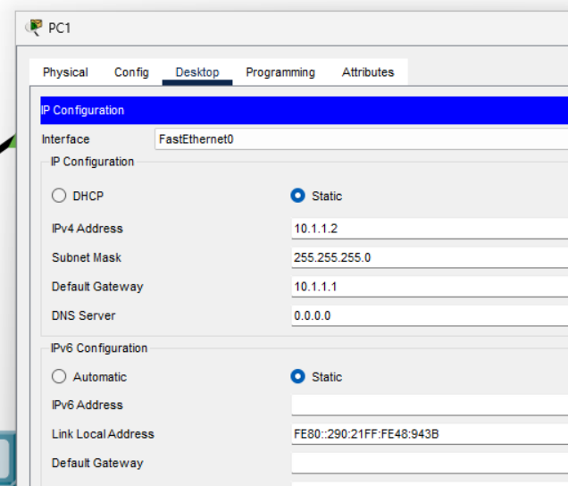
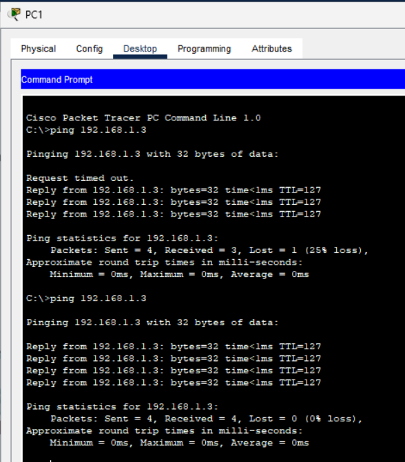

# **CISCO Packet Tracer Tutorial**

Are you new to using CISCO packet tracer and not sure where to actually start? Then this tutorial is for you! I know the struggle of trying to figure out something new so I hope this helps you get your footing in using CISCO packet tracer.

To follow along with this tutorial you will need to have installed CISCO packet tracer, which can be found here -

<https://www.netacad.com/courses/packet-tracer>

## **Let's start**

The first step is to get a hang of the different devices you can add to your network diagram.
For this tutorial we will be using the router 2911 as it allows for 3 switches to be connected. We will then be using the default switch under switches which is the 2960 version.



You can drag and drop these anywhere onto the display area within CISCO to get started on creating the network structure. For the first part of this tutorial we will be going for a structure like this -



To add connections you can select the lightning bolt in the bottom left, in this tutorial we will be using the copper straight through cable, if you build different more complex structures in the future you may need to use different cable types.

## **Connection Instructions -**

When you go to connect there is a lot of options, so this is what you will do for setting up all the cables.
Connecting the PC's to the switches -

1. PC1 - Select `FastEthernet0` on the `PC1` and connect to `switch0` on the `FastEthernet0/1 port`.
2. PC2 - Select `FastEthernet0` on the `PC2` and connect to `switch0` on the `FastEthernet0/2 port`.
3. Repeat the same structure for `PC3` and `PC4`, however connecting them to `switch1`.
4. Connecting the switches with the router -
5. For `switch0` you want to select `GigabitEthernet0/1` and connect it to the port `GigabitEthernet0/0` on the router.
6. For `switch1` you want to select `GigabitEthernet0/1` and connect it to the port `GigabitEthernet0/1` on the router.

What you've built should now look like this -



## **Configuration Settings**

Now the following instructions will go over how to configure the settings in the router and PC for them to communicate correctly.

### **Step 1 -**

Click on the router and open up the CLI window.
In the system configuration you want to select no, then press return/enter to get started.
You will type the following in order to configure the settings which should end up looking like the below screenshot.

```bash
enable
config t
interface g0/0
ip address 10.1.1.1 255.255.255.0
no shutdown
exit
interface g0/1
ip address 192.168.1.1 255.255.255.0
no shutdown
exit
```



Congrats! You've now configured the IP addresses within the router for your two switches.

### **Step 2 -**

Now you need to set up each PC to configure their connections to the router.



1. C1 and switch to the desktop tab
2. Select IP Configuration
3. In IPv4 enter the subnet address for the PC's.
4. Followed by the subnet mask of `255.255.255.0`
5. Then set the default gateway to `10.1.1.1`
The specific settings for each PC is -

``` bash
PC1 - IPv4 address of 10.1.1.2 subnet mask 255.255.255.0 and default gateway 10.1.1.1

PC2 - IPv4 address of 10.1.1.3 subnet mask 255.255.255.0 and default gateway 10.1.1.1

PC3 - IPv4 address of 192.168.1.2 subnet mask 255.255.255.0 and default gateway 192.168.1.1

PC4 - IPv4 address of 192.168.1.3 subnet mask 255.255.255.0 and default gateway 192.168.1.1
```

Now you're set up! Well done!

## **How to test your configuration**

To test your configuration in the real time settings, you can select any of the 4 PC's then switch to desktop and select command prompt. Then type ping `ip address` of the computer you want to connect to.



Example to ping from PC1 to PC4, I would open PC1 and then type in command prompt - `ping 192.168.1.3`
I will then get something like the window on the left, generally the first time pinging a newly made connection the first request will time out.
You can also test this with the simulation feature, if you would like to see this check the linked YouTube video and go to at 9:06 minutes.

## **Adding more Devices**

If you would like to add more PC's to an already existing switch all you need to do is drag it in, connect and then update the PC configuration, you need to do the same subnet/default gateway but change the IPv4 address to a new end number as its a new connection.
If you would like to add another switch with more PC's, then you will need to drag them in/set up connections. Then head back up to the router step, you want to repeat this but only for the `GigabitEthernet0/2`. Followed by setting up the computers.
There you have it! I hope this tutorial was helpful and you learned how to get started.

## Watch my tutorial on the process on YouTube

<div style="text-align: center;">  
  <div style="position: relative; height: 315px; width: 560px; margin: 0 auto;">  
    <iframe src="https://www.youtube.com/embed/sLhzgGUcLvU?si=jF8yHBjY4EP_tNbN" style="position: absolute; top: 0; left: 0; width: 100%; height: 100%;" frameborder="0" allow="accelerometer; autoplay; encrypted-media; gyroscope; picture-in-picture" allowfullscreen></iframe>  
  </div>  
</div>
