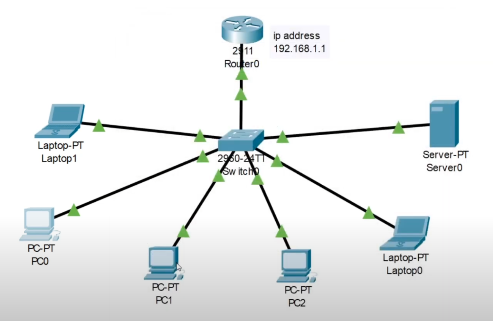
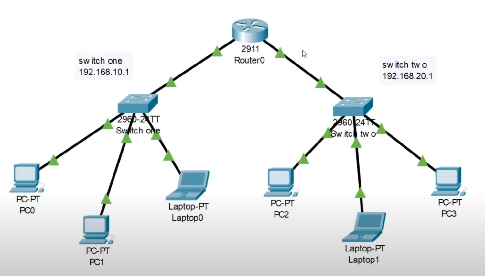
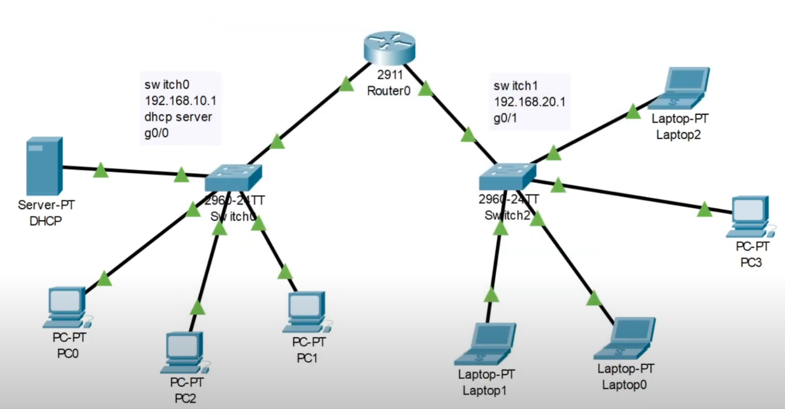

# **DHCP Server setup in CISCO Packet Tracer**

Introduction: Configuring a DHCP server is a fundamental skill for network administrators and engineers. In this blog post, we'll explore three video tutorials that walk you through DHCP server configuration using CISCO Packet Tracer. Whether you're dealing with a single switch, a router-based setup, or a complex network with multiple switches, you'll find step-by-step instructions to help you get started.

## **Video 1: DHCP Server Configuration with a Single Switch**

  
  
  
    <iframe src="https://www.youtube.com/embed/uf7LQG7vrhY?si=wbkQOKUwLAIS4EZ-" style="position: absolute; top: 0; left: 0; width: 100%; height: 100%;" frameborder="0" allow="accelerometer; autoplay; encrypted-media; gyroscope; picture-in-picture" allowfullscreen></iframe>  
  
  

In this video, you'll learn how to set up a DHCP server within CISCO Packet Tracer using a single switch. This tutorial simplifies the process, making it easy for beginners to understand and implement. 

### Here are the steps:

1. Enable the CLI.
2. Enter global configuration mode: `conf t`
3. Configure the switch interface: `int g0/0`
4. Assign an IP address and subnet mask to the interface: `ip address 192.168.1.1 255.255.255.0`
5. Enable the interface: `no shutdown`
6. Save the configuration: `do write memory`
7. Exit interface configuration mode: `exit`
8. Configure the DHCP pool:
    - `ip dhcp pool ABC-POOL`
    - Define the network: `network 192.168.1.0 255.255.255.0`
    - Set the default router: `default-router 192.168.1.1`
    - Specify the DNS server: `dns-server 192.168.1.254`
9. Exit the DHCP pool configuration: `exit`
10. Save the configuration again: `write memory`

### **Video 2: Router-Based DHCP Server Configuration**

  
  
  
    <iframe src="https://www.youtube.com/embed/MWgWjkGP2gQ?si=pR_AxIyUCQl09xrr" style="position: absolute; top: 0; left: 0; width: 100%; height: 100%;" frameborder="0" allow="accelerometer; autoplay; encrypted-media; gyroscope; picture-in-picture" allowfullscreen></iframe>  
  
  

In the second video, you'll discover how to configure a router to manage DHCP within CISCO Packet Tracer. This approach allows you to automatically assign IP addresses to connected devices.

### Here are the steps:

1. Enable the CLI.
2. Enter global configuration mode: `conf t`
3. Configure the router's first interface: `int g0/0`
4. Assign an IP address and subnet mask: `ip address 192.168.10.1 255.255.255.0`
5. Enable the interface: `no shutdown`
6. Save the configuration: `do write memory`
7. Create a DHCP pool for the first switch:
    - `ip dhcp pool switch1`
    - Define the network: `network 192.168.10.1 255.255.255.0`
8. Exit the pool configuration: `exit`
9. Configure the router's second interface: `int g0/1`
10. Assign an IP address and subnet mask: `ip address 192.168.20.1 255.255.255.0`
11. Enable the interface: `no shutdown`
12. Save the configuration: `do write memory`
13. Create a DHCP pool for the second switch:
    - `ip dhcp pool switch2`
    - Define the network: `network 192.168.20.1 255.255.255.0`

### **Video 3: DHCP Server Configuration with Multiple Switches**

  
  
  
    <iframe src="https://www.youtube.com/embed/orLhQDjYTvc?si=61igIQfS5ndnHhXM" style="position: absolute; top: 0; left: 0; width: 100%; height: 100%;" frameborder="0" allow="accelerometer; autoplay; encrypted-media; gyroscope; picture-in-picture" allowfullscreen></iframe>  
  
  

The third video guides you through setting up a home network with multiple switches and a dedicated DHCP server. This scenario mimics a more complex real-world environment.

### Follow these steps-

1. Start by configuring the DHCP server:
    - Set the server's static IP address to `192.168.10.2` (the default gateway for switch 1)
    - Create a DHCP pool for the first switch, naming it "SwitchONE," with a default gateway of `192.168.10.1` and a starting IP of `192.168.10.3`, allowing up to 20 addresses.
    - Repeat the DHCP pool creation for the second switch, starting with 2.2 as it has no server.
2. Configure the router:
    - Enter global configuration mode: `conf t`
    - Configure the first interface: `int g0/0`
    - Assign the IP address and specify the helper address (the server address):
    - `ip address 192.168.10.1 255.255.255.0`
    - `ip helper-address 192.168.10.2`
    - Enable the interface: `no shutdown`
    - Save the configuration: `do write memory`
3. Configure the second interface of the router in a similar fashion.

### **Conclusion:**

Configuring DHCP servers is an essential skill for managing IP address allocation within a network. These three videos, ranging from single switches to complex network setups, provide comprehensive guidance on DHCP server configuration using CISCO Packet Tracer. Whether you're a novice or an experienced network administrator, these tutorials will help you gain the expertise you need. Happy networking!
