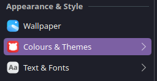
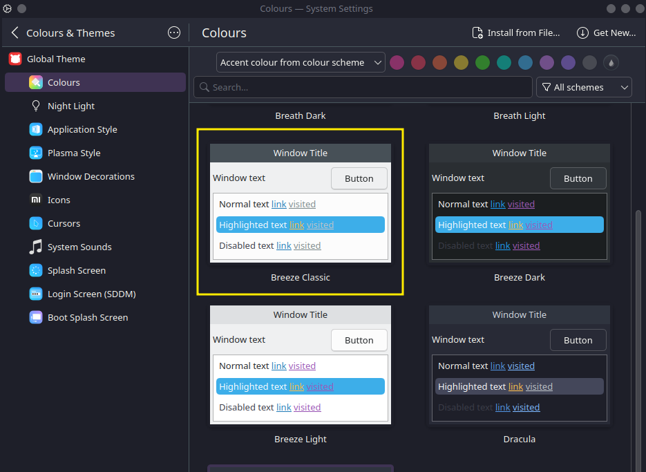
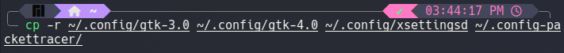
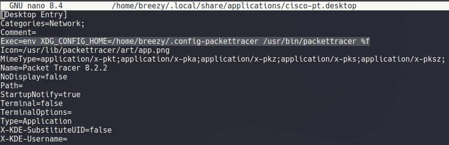

# Fixing Cisco Packet Tracer’s Ugly Dark Theme on KDE

If you’ve opened Cisco Packet Tracer on a KDE desktop environment, only to be met with a UI that looks completely off, dark buttons on dark backgrounds, unreadable text, and overall bad vibes, you're not alone.

Packet Tracer doesn’t follow your system theme properly on KDE due to how it handles environment variables for GTK-based apps. But the good news? You can fix it with a simple workaround.

Here’s how to make Cisco Packet Tracer look *decent* in KDE.

---

## Step 1: Temporarily Set Your System to a Light Theme

Before doing anything else:

1. Open your **System Settings**.
2. Under **Appearance and Style**, select **Colours and Themes**.
    
3. Click on **Colours** under the **Global Theme** section.
4. Choose a **light colour scheme** (such as Breeze Light or similar) and apply the changes.
    

This will make Packet Tracer look good **at least once**. But we’ll make it permanent in the next steps.

---

## Step 2: Create a Dedicated Config Folder

We’re going to snapshot your current (good-looking) light theme settings and isolate them just for Packet Tracer:

```bash
mkdir ~/.config-packettracer
```


---

## Step 3: Copy GTK Configuration Files

Now copy your current GTK theme settings to that new folder:

```bash
cp -r ~/.config/gtk-3.0 ~/.config/gtk-4.0 ~/.config/xsettingsd ~/.config-packettracer/
```



You don’t need the entire contents of `~/.config`, just the theme-related bits.

---

## Step 4: Modify the Launcher to Use Your Custom Config

Instead of launching Packet Tracer normally, we’ll set it to use the isolated light theme configuration. Open the Packet Tracer launcher for editing:

```bash
nano ~/.local/share/applications/cisco-pt.desktop
```

Look for the line that starts with:

```ini
Exec=/usr/bin/packettracer %f
```

And **replace it** with this:

```ini
Exec=env XDG_CONFIG_HOME=/home/yourusername/.config-packettracer /usr/bin/packettracer %f
```



Make sure to replace `/home/yourusername` with your actual home path (e.g., `/home/breezy`).

Leave everything else in the file as-is.

Now when you launch Packet Tracer from the applications menu, it’ll use your preserved light theme settings, no need to change your whole system theme every time.

---

## Step 5: Switch Your System Theme Back (Optional)

After you’ve copied the theme files, you can go back to your normal dark KDE theme. Packet Tracer will still launch with the isolated light theme settings you preserved.

---

## Done

You now have a version of Cisco Packet Tracer that uses a readable, light UI, without having to switch your entire KDE desktop theme every time.
