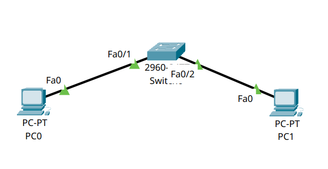
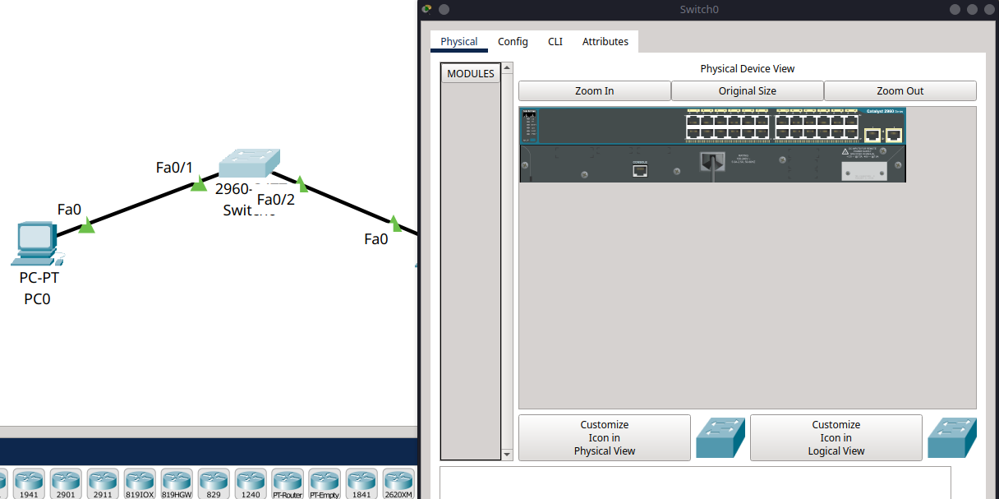
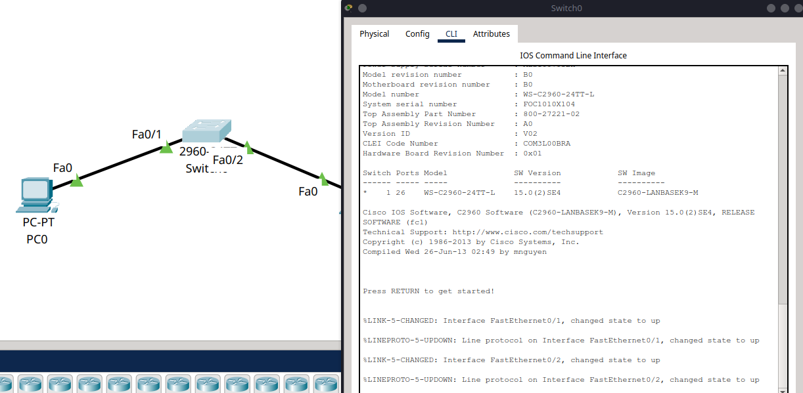

# 1 - How to access the CLI on a Router or Switch

If you're just getting started with **Cisco Packet Tracer**, one of the first things you'll need to learn is how to access the **Command Line Interface (CLI)** on network devices like routers and switches. The CLI is where you configure devices, troubleshoot issues, and run essential networking commands.

In this short tutorial, we’ll show you exactly how to access the CLI of a router or switch in Cisco Packet Tracer.

---

## Step 1 – Open Your Cisco Packet Tracer Project

Start by opening Cisco Packet Tracer and either:

* Create a new project
* Or open an existing file with at least one switch or router in it

Once your topology is on the workspace, you’re ready to go.



---

## Step 2 – Click on the Device

Click directly on the router or switch icon in your workspace. A configuration window will pop up.



---

## Step 3 – Go to the CLI Tab

At the top of the configuration window, you’ll see several tabs. Click on the **“CLI”** tab to open the Command Line Interface.

This is where you’ll be able to enter commands like `enable`, `configure terminal`, and many others to set up your device.



```{admonition} Tip
:class: tip
The CLI will usually begin with some initialisation text or a prompt asking if you want to enter initial configuration. You can press `Enter` to continue or type `no` if prompted with "Would you like to enter the initial configuration dialog?"
```

---

## Step 4 – You’re In!

You should now see the device prompt (e.g., `Switch>` or `Router>`). From here, you can start entering commands.

Some common ones to try:

```bash
enable
configure terminal
```

```{admonition} Tip
:class: tip
You can also use the shorthand `conf t` to enter global configuration mode.
```

This will take you into privileged EXEC mode and then into global configuration mode, where you can start configuring your device.

So there you have it! You’ve successfully accessed the CLI of a router or switch in Cisco Packet Tracer. This is the first step in learning how to configure and manage your network devices effectively.
