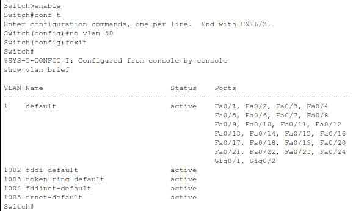

# 2 - How to remove a VLAN from a Switch

Mistakes happen, especially when you're learning. If you’ve accidentally added the wrong VLAN to a Cisco switch in Packet Tracer, don’t worry. In this tutorial, we’ll walk you through how to **remove a VLAN** that you no longer need.

---

## Step 1 – Access the Switch CLI

First, click on the switch in your topology.

Then:

1. Select the **CLI** tab
2. Press `Enter` to get to the switch prompt

You should now see something like:

```ini
Switch>
```

---

## Step 2 – Enter Privileged EXEC Mode

Before you can make changes, enter privileged mode:

```bash
enable
```

The prompt should change to:

```ini
Switch#
```

---

## Step 3 – Enter Global Configuration Mode

Type the following:

```bash
configure terminal
```

```{admonition} Tip
:class: tip
You can also use the shorthand `conf t` to enter global configuration mode.
```

Now you’re in global config mode:

```ini
Switch(config)#
```

---

## Step 4 – Remove the VLAN

Let’s say you accidentally created VLAN 50. Which we've simulated in this example.


 To remove it, type (make sure you're still in global config mode):

```bash
no vlan 50
```

```{admonition} Important
:class: important
Make sure to replace `50` with the actual VLAN number you want to remove. You can always use `show vlan brief` to check existing VLANs.
```

This deletes VLAN 50 from the VLAN database.



---

## Summary

Removing a VLAN from a Cisco switch is straightforward once you know the commands. Use `no vlan [number]` to delete unwanted VLANs and keep your configuration clean.
