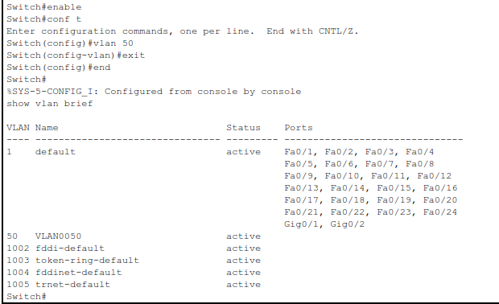

# 3 – How to Reset Activity in Packet Tracer

Sometimes, when working on a **.pka activity file** in Cisco Packet Tracer, you might want to clear your progress and start again from scratch. Whether you’ve made a mistake or simply want a clean slate, the **Reset Activity** feature makes it easy.

This guide shows you how to reset a `.pka` file back to its original state.

---

## Step 1 – Open the Activity File

Launch **Cisco Packet Tracer**, then go to:

* **File** → **Open**
* Select your `.pka` activity file and click **Open**

You’ll see the activity window with the instructions on the left and the network topology on the right.

---

## Step 2 – Reset the Activity

To reset the activity:

1. Click **File** in the top menu bar
2. Select **Reset Activity** from the dropdown

Alternatively, you can press **Alt + N** on your keyboard.

> **Tip:** Some activities also include a **Reset Activity** button directly in the instruction panel. Clicking that will do the same thing.

---

## Step 3 – Confirm Reset

Once you click **Reset Activity**, Packet Tracer will:

* Remove all your configurations
* Return the activity to its original, untouched state
* Update the timestamp in the title bar to reflect the reset

---

## Summary

The **Reset Activity** option in Cisco Packet Tracer is perfect for when you need a do-over. Use it any time you want to clear your work and try again—especially useful when preparing for assessments or fine-tuning your skills.
