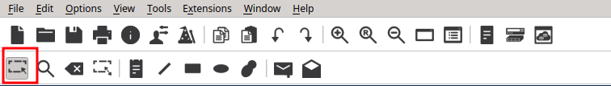

# 4 – How to Label Devices in Packet Tracer

When building topologies in Cisco Packet Tracer, things can quickly get messy, especially as your network grows. Adding **labels** to your devices and connections helps keep everything organised. Labels can show **IP addresses**, **VLAN numbers**, **trunk ports**, or even device roles, making it much easier to follow and troubleshoot your design.

This tutorial will walk you through how to add labels to your devices and connections.

---

## Step 1 – Open the Topology

Begin by opening your Cisco Packet Tracer project file.

In this example, we have a small network (the one from [Tutorial 4](../../tutorial-series/tutorial4.md)) with a router, switches and PCs.


---

## Step 2 – Select the Text Tool

In the second row of icons at the top of the Packet Tracer window, find the **Text tool** (it looks like a piece of paper).


Then click anywhere in the workspace to drop a label.

---

## Step 3 – Enter Your Label

A small window will appear where you can type your text.

You might want to label things like:

* **IP Addresses**
  e.g., `192.168.10.1`
* **VLAN IDs or Names**
  e.g., `VLAN 10`
* **Trunk Links**
  e.g., `Trunk to SW2`
* **Default Gateway Info**
  e.g., `GW: 192.168.10.1`

Once entered, click **OK** and the label will appear in the workspace.

You can drag it to reposition it near a device or link.


---

## Step 4 – Move or Edit the Label

To move or edit a label later:

1. Switch back to the **Select tool (arrow icon)**
   
2. Drag the label to a new position to move it
3. Or click on the label to edit its text

---

## Step 5 – Use Labels to Improve Readability

Here are some examples of how labels can be helpful:

```{admonition} Tip
:class: tip
Use labels to display key configuration info at a glance:
- IPs on router interfaces
- VLAN assignments on switchports
- DHCP range for a subnet
- Trunk connections between switches
```

This is especially useful during assignments, exams, or presentations, where readability is key.
