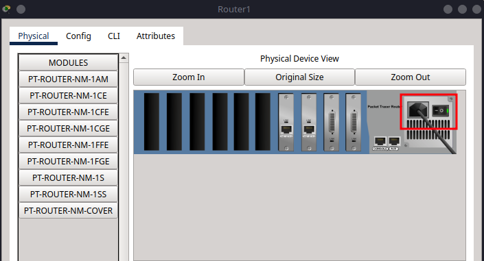

# 5 – How to Customise the Router-PT in Packet Tracer

This guide shows you how to **customise a Router-PT or Router-PT-Empty** device in Cisco Packet Tracer by adding or removing network interface modules.

Customising routers lets you choose the exact combination of **Ethernet**, **Serial**, and other ports required for your topology.

---

## Part 1 – Accessing the Physical Configuration

1. Select a **Router-PT** or **Router-PT-Empty** from the device list and drag it into the workspace.
2. Click the router to open its configuration window.
3. Go to the **Physical** tab.

---

## Part 2 – Powering Off Before Modifying

Before making hardware changes:

1. Click the **power button** (top left corner of the router image).
2. Wait until the green light turns off, this ensures safe module installation.

---

## Part 3 – Adding or Removing Modules

1. In the **module pane** (left side), locate the module you need.
2. Drag the module into an empty slot on the router.
3. Modules must be installed **from right to left**.

To remove a module:

1. Click and drag it **out** of the router slot while powered off.

---

## Part 4 – Powering On

Once your modules are installed:

1. Click the **power button** again to turn the router back on.
2. The green light will return, and the added interfaces will become available in the CLI and config tabs.

---

## Part 5 – Common Router-PT Modules

Below is a table listing commonly used modules you’ll find in the **module selection pane**:

| Module Name          | Description                     | Interface Type    |
| -------------------- | ------------------------------- | ----------------- |
| `PT-ROUTER-NM-1AM`   | Analog Modem Module             | Modem             |
| `PT-ROUTER-NM-1CE`   | Coaxial Ethernet                | Ethernet (Coax)   |
| `PT-ROUTER-NM-1CFE`  | 1-Port FastEthernet             | FastEthernet      |
| `PT-ROUTER-NM-1CGE`  | 1-Port GigabitEthernet          | GigabitEthernet   |
| `PT-ROUTER-NM-1FFE`  | 1-Port FastEthernet (Fiber)     | FastEthernet (FX) |
| `PT-ROUTER-NM-1FGE`  | 1-Port GigabitEthernet (Fiber)  | Gigabit (FX)      |
| `PT-ROUTER-NM-1S`    | 1-Port Serial                   | Serial            |
| `PT-ROUTER-NM-1SS`   | 1-Port Smart Serial             | Smart Serial      |
| `PT-ROUTER-NM-COVER` | Blank cover slot (no interface) | N/A               |

## Tutrials Using Router-PT

- [Tutorial 9: Configuring Static Routing in Packet Tracer](../tutorial-series/tutorial9.md)
- [Tutorial 10: Configuring RIP Routing in Packet Tracer](../tutorial-series/tutorial10.md)
- [Tutorial 11: Configuring OSPF Routing in Packet Tracer](../tutorial-series/tutorial11.md)