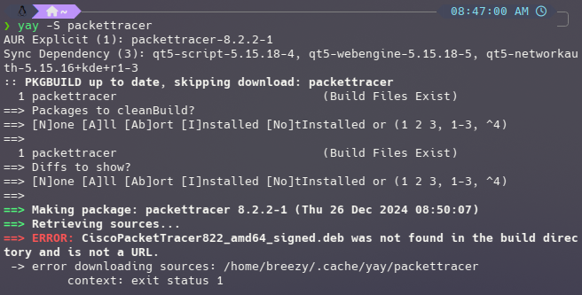
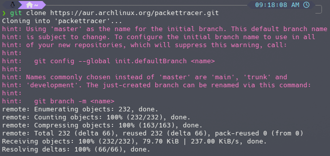
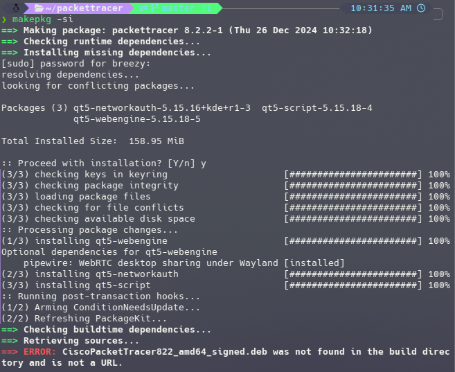
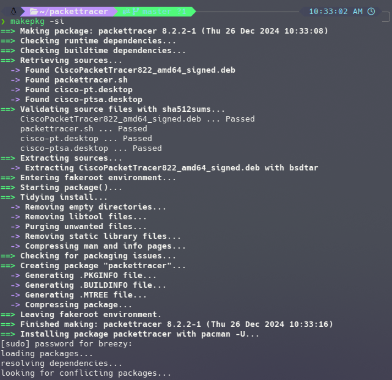
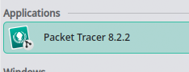

# How to install CISCO Packet Tracer in Arch Linux

This guide will walk you through the steps to install CISCO Packet Tracer on an Arch Linux system. Packet Tracer is a powerful network simulation tool widely used for learning and practicing networking concepts. It is technically available on AUR (Arch User Repository), but the installation process requires some additional steps compared to Debian-based systems.

## Download CISCO Packet Tracer

To download CISCO head to the following link and download the deb package for Linux.
[https://www.netacad.com/courses/packet-tracer](https://www.netacad.com/courses/packet-tracer)

## Step 1

Packet tracer is available on AUR, however it requires some additional steps to get it to work.
For example if you go straight to installing it from AUR with the command `yay -S packettracer` you will face an error -

First you need to download the git clone -

`git clone https://aur.archlinux.org/packettracer.git`

then move the packet tracer deb file into this location, as I downloaded the deb file to downloads, and git clone to downloads i just needed to do -

`mv ~/Downloads/Packet_Tracer822_amd64_signed.deb packettracer`

Then `cd packettracer`

Run `ls` to confirm the deb file is there

## Step 2 makepkg

Now, we can run the command `makepkg -si` to make the build for packet tracer.
You may encounter an error like this though -

This issue arises from the download file name not being the same as whats in the pkgbuild file. To fix this, just rename the .deb file to be the same name shown in the build fail. This can be done with the command -

`mv Packet_Tracer822_amd64_signed.deb CiscoPacketTracer822_amd64_signed.deb`

then once again run `makepkg -si`

And now CISCO packet tracer is installed!

## Theme Issues

If you are using KDE Plasma, you may notice that Packet Tracer does not follow your system theme properly. This is a known issue with how Packet Tracer handles GTK-based applications in KDE. To fix this, you can follow the steps outlined in the [KDE Theme Fix Guide](../cisco/fix-kde-dark-theme.md).

## Video: Installing CISCO Packet Tracer in Arch Linux

You can also watch the video below to see how to install CISCO Packet Tracer in Arch Linux. This video provides a step-by-step guide, making it easier to follow along with the installation process.

  
  
  
    <iframe src="https://www.youtube.com/embed/vzLEQkg3M84?si=F4M5MLRBVl_R25dg" style="position: absolute; top: 0; left: 0; width: 100%; height: 100%;" frameborder="0" allow="accelerometer; autoplay; encrypted-media; gyroscope; picture-in-picture" allowfullscreen></iframe>  
  
  

