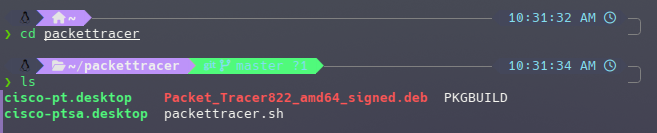

# **How to install CISCO Packet Tracer in Arch Linux**

## Download CISCO Packet Tracer

To download CISCO head to the following link and download the deb package for Linux.
[https://www.netacad.com/courses/packet-tracer](https://www.netacad.com/courses/packet-tracer)

## Step 1

Packet tracer is available on AUR, however it requires some additional steps to get it to work.
For example if you go straight to installing it from AUR with the command `yay -S packettracer` you will face an error -

First you need to download the git clone -

`git clone https://aur.archlinux.org/packettracer.git`

then move the packet tracer deb file into this location, as I downloaded the deb file to downloads, and git clone to downloads i just needed to do -

`mv ~/Downloads/Packet_Tracer822_amd64_signed.deb packettracer`

Then `cd packettracer`

Run `ls` to confirm the deb file is there

## Step 2 makepkg

Now, we can run the command `makepkg -si` to make the build for packet tracer.
You may encounter an error like this though -

This issue arises from the download file name not being the same as whats in the pkgbuild file. To fix this, just rename the .deb file to be the same name shown in the build fail. This can be done with the command -

`mv Packet_Tracer822_amd64_signed.deb CiscoPacketTracer822_amd64_signed.deb`

then once again run `makepkg -si`

And now CISCO packet tracer is installed!

