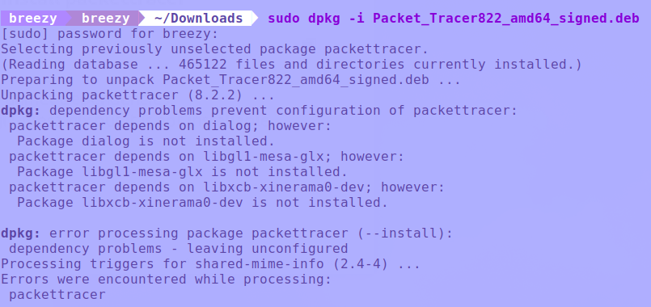
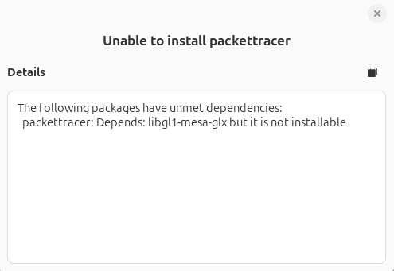
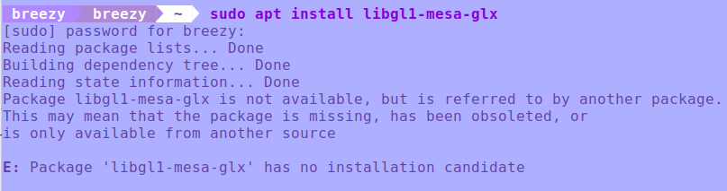
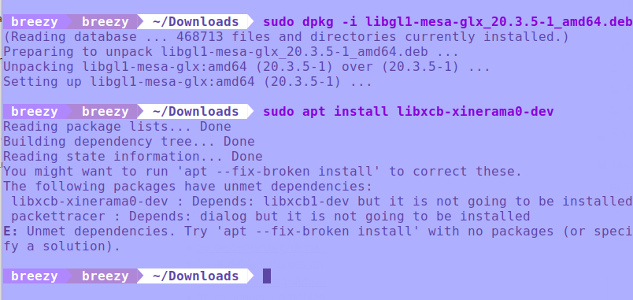
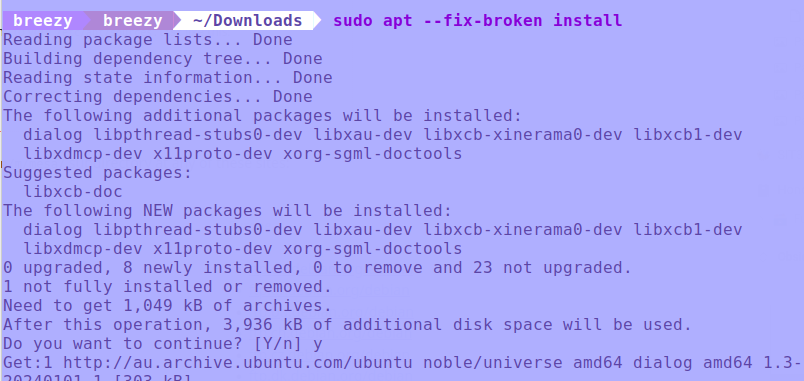
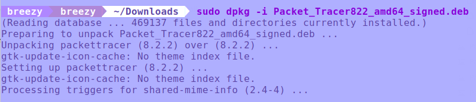

# **How to install CISCO Packet Tracer in Ubuntu**

## Download CISCO Packet Tracer

To download CISCO head to the following link and download the deb package for Linux.
[https://www.netacad.com/courses/packet-tracer](https://www.netacad.com/courses/packet-tracer)

## Installation

To install CISCO Packet tracer you do the following command `sudo dpkg -i Packet_Tracer822_amd64_signed.deb`, please note if you downloaded a different version you will need to modify that to the version you selected. You can also install using package installer GUI. If you're running Ubuntu 22.04 or 24.04 you will be faced with an error over a dependency package. CISCO Packet Tracer requires `libgll-mesa-glx` and `libxcb-xinerama0-dev`

## Fixing missing dependencies

To install `libgl1-mesa-glx` you would typically use the apt command, however this package has been depreciated and will not install using this method. You'll receive an error something like the following:

To get around this, you can download this package from debian as a deb file.

[Download libgl1-mesa-glx from Debian](https://packages.debian.org/bullseye/amd64/libgl1-mesa-glx/download)

This can then be installed in the same way as we tried prior for CISCO. Either using package installer or the command `sudo dpkg -i libgl1-mesa-glx_20.3.5-1_amd64.deb` to install this dependency. After this we can install the other missing dependency by doing `sudo apt install libxb-xinerama0-dev`, after this you may or may not have some unmet dependencies which can be solved by running  `sudo apt --fix-broken install`.

## Installing CISCO

Now that the package dependencies have been resolved, you're ready to go back to the first command for installing CISCO Packet tracer. With the command `sudo dpkg -i Packet_Tracer822_amd64_signed.deb`, after this check your applications to find CISCO packet tracer. Now you're ready to start using CISCO Packet Tracer in your tasks.

