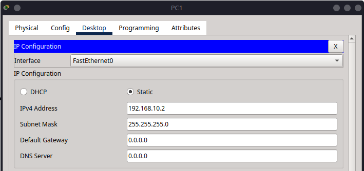

# 1 – Basic Networking  

This tutorial is the first in a series designed to introduce you to networking concepts using Cisco Packet Tracer. It will guide you through creating a simple network with two PCs connected via a switch, configuring both IPv4 and IPv6 addresses, and testing connectivity using the `ping` command.

Find the CISCO pkt files in the repo -


## Creating a Simple Network with Two PCs and a Switch in Cisco Packet Tracer

In this first tutorial, we will step through how to build a basic local network using Cisco Packet Tracer. This network will consist of two end devices (PCs) connected through a switch. We will assign both **IPv4** and **IPv6** addresses manually and test communication between the devices using the `ping` command.

This exercise introduces core networking concepts such as MAC and IP addressing, switching, and address-based communication. It is suitable for beginners who are just getting started with Packet Tracer or networking in general.

---

## Part 1 – Building the Network Topology

The network topology we are going to build is very simple:

```bash
\[PC0] —— \[Switch] —— \[PC1]
```

This is often referred to as a **point-to-point LAN segment**, although it involves a switch rather than a direct cable connection. It represents the kind of connection you’d see in a small office or lab environment.

### Step 1.1 – Add Devices to the Workspace

1. Launch Cisco Packet Tracer.
2. At the bottom left, open the **End Devices** panel.
3. Drag **PC0** and **PC1** into the main canvas.
4. Open the **Switches** panel and drag a **2960 switch** into the canvas.


### Step 1.2 – Connect Devices Using Cables

1. From the **Connections** bar (lightning bolt icon), choose the **Copper Straight-Through** cable.
2. Click on **PC0** → select `FastEthernet0`, then click on **Switch0** → select `FastEthernet0/1`.
3. Repeat the process for **PC1**, but connect it to `FastEthernet0/2` on the switch.


---

## Part 2 – Configuring IPv4 Settings

In this section, we will manually configure IPv4 addresses for both PCs so they are part of the same subnet and able to communicate directly. We'll use the graphical interface (GUI) on each device to assign IP addresses.

This configuration is essential to allow the devices to recognise and communicate with each other across the local network.

---

### Step 2.1 – Assign IPv4 Address to PC0 (via GUI)

1. Click on **PC0** to open its configuration window.
2. Navigate to the **Desktop** tab and select **IP Configuration**.
3. Under the IPv4 section, set the following values:
   - **IP Address**: `192.168.10.1`
   - **Subnet Mask**: `255.255.255.0`
   - Leave the **Default Gateway** field blank

This assigns PC0 a static IP address in the `192.168.10.0/24` network.


---

### Step 2.2 – Assign IPv4 Address to PC1 (via GUI)

1. Click on **PC1**, go to the **Desktop** tab, and open **IP Configuration**.
2. Enter the following IPv4 settings:
   - **IP Address**: `192.168.10.2`
   - **Subnet Mask**: `255.255.255.0`
   - Leave the **Default Gateway** field blank

By assigning an IP address in the same subnet, PC1 is now able to communicate directly with PC0.



---

### Verifying IP Configuration

To confirm the IP settings on each PC:

1. Go to the **Desktop** tab on each PC.
2. Open **Command Prompt**.
3. Type the following command:

   ```bash
   ipconfig
    ```

    

---

## Part 3 – Testing IPv4 Communication

### Step 3.1 – Ping from PC0 to PC1

1. On **PC0**, go to the **Desktop** tab, then open the **Command Prompt**.
2. Enter the following command:

    ```bash
    ping 192.168.10.2
    ```

3. You should receive four reply messages. This confirms that the connection is working over IPv4.

If you see timeouts:

- Check the IP address and subnet mask on both PCs
- Ensure the cables are properly connected
- Confirm the switch is powered on and all ports are active


---

## Part 4 – Configuring IPv6 Settings

IPv6 allows for a much larger address space and is increasingly important for modern networks. Unlike IPv4, IPv6 uses hexadecimal and colons to represent addresses.

### Step 4.1 – Assign IPv6 Address to PC0

In the **IP Configuration** window on PC0, scroll to the **IPv6 Configuration** section:

- IPv6 Address: `2001:db8:acad::1`
- Prefix Length: `64`

This corresponds to the address range `2001:db8:acad::/64`, which is a common documentation/test prefix.


### Step 4.2 – Assign IPv6 Address to PC1

Do the same for PC1:

- IPv6 Address: `2001:db8:acad::2`
- Prefix Length: `64`

Now both devices are on the same IPv6 subnet.


---

## Part 5 – Testing IPv6 Communication

### Step 5.1 – Ping Using IPv6

1. On **PC0**, open the **Command Prompt** again.
2. Use the `ping` command with the IPv6 address:

   ```bash
   ping 2001:db8:acad::2
   ```

This will test whether PC0 can reach PC1 using IPv6. You should again receive successful replies.


---

## Additional Notes

- **MAC Addresses**: Although not configured here, each PC has a unique MAC address. The switch learns which MAC is on which port dynamically.
- **ARP vs NDP**: For IPv4, communication begins with ARP (Address Resolution Protocol); for IPv6, it uses NDP (Neighbour Discovery Protocol).
- **No Routing Required**: Because this is a single subnet, no router is required for communication.

---

## Summary

In this tutorial, you learned how to:

- Build a simple LAN with two PCs and a switch in Cisco Packet Tracer
- Manually configure and verify IPv4 and IPv6 addresses
- Use the `ping` command to test network connectivity
