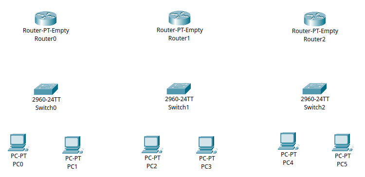
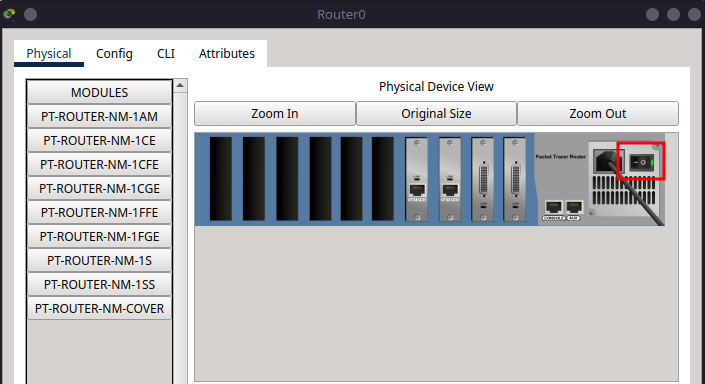
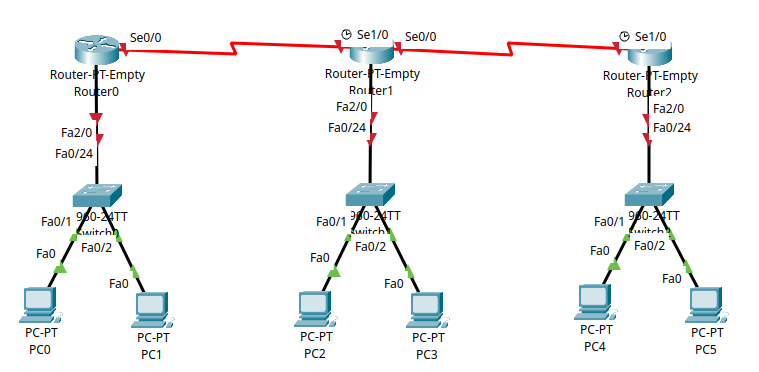
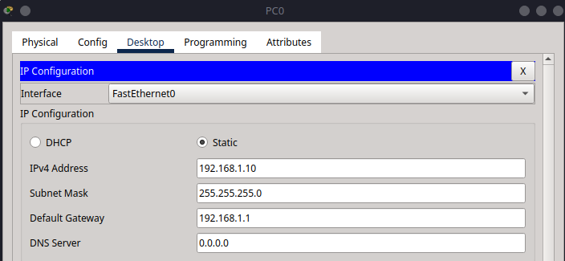
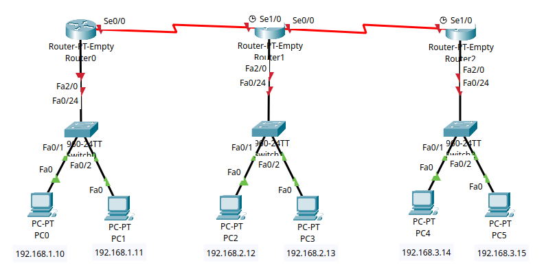

# 10 - Configuring RIP Routing in Cisco Packet Tracer

This tutorial is the ninth in our Cisco Packet Tracer series and introduces **dynamic routing** using the **Routing Information Protocol (RIP)**. Unlike static routes, RIP enables routers to exchange routing information automatically, making it easier to scale and manage networks with multiple paths.

We'll use the same three-router topology from the previous tutorial, manually configure IP addresses, and add static routes to ensure full connectivity between all PCs.

---

## Part 1 – Network Topology Overview

This network includes:

* **Three routers (R1, R2, R3)** connected in a linear series
* **Three switches (S1, S2, S3)** – one per router
* **Two PCs per switch** (6 total PCs)

The goal is to enable all PCs to communicate through RIP-configured routers.


---

## Part 2 – Device Placement and Cabling

### Step 2.1 – Add Devices to the Workspace

From **Network Devices** and **End Devices**, place:

* **3 Routers** (Router-PT-Empty)
* **3 Switches** (2960)
* **6 PCs**

Label the devices:

* Routers: **R0**, **R1**, **R2**
* Switches: **S0**, **S1**, **S2**
* PCs: **PC0–PC5**



### Step 2.2 – Add Network Modules to Routers

For this topology, use **Router-PT-Empty** devices. Each router needs **two Serial** and **two FastEthernet** interfaces to support all required connections.

```{admonition} Note
:class: note
We will only be using one serial and one FastEthernet interface per router for this tutorial, but the additional interfaces will allow for future expansion in subequent tutorials.
```

Follow these steps for **R0**, **R1**, and **R2**:

1. Click the router to open its configuration window.
2. Go to the **Physical** tab.
3. Click the **power button** to turn off the router (the green light will go out).
   
4. In the module area, locate **PT-ROUTER-NM-1S** (Serial Port) and **PT-ROUTER-NM-1CFE** (FastEthernet).
5. Drag and insert **two** PT-ROUTER-NM-1S modules into the first two empty slots (from right to left).
   
6. Drag and insert **two** PT-ROUTER-NM-1CFE modules into the next two empty slots.
   
7. Click the **power button** again to turn the router back on.
   

### Step 2.2 – Cabling

Now we will connect the devices using appropriate cables:

```{admonition} Note
:class: note
For clarity and future expansion, I recommend connecting the switch to the router using the last available port on the switch (for example, fa0/24). This keeps the lower-numbered ports free for connecting PCs and other end devices.
```

#### **Copper Straight-Through Connections**

| From   | To   | Port/Interface         |
|--------|------|------------------------|
| PC0    | S1   | fa0/1                  |
| PC1    | S1   | fa0/2                  |
| S1     | R0   | fa0/24 → fa2/0         |
| PC2    | S2   | fa0/1                  |
| PC3    | S2   | fa0/2                  |
| S2     | R1   | fa0/24 → fa2/0         |
| PC4    | S3   | fa0/1                  |
| PC5    | S3   | fa0/2                  |
| S3     | R2   | fa0/24 → fa2/0         |

#### **Serial DTE Connections**

| From | To | Port/Interface    |
|------|----|-------------------|
| R0   | R1 | se0/0 ↔ se1/0     |
| R1   | R2 | se0/0 ↔ se1/0     |



---

## Part 3 – IP Addressing Scheme

Now we will assign IP addresses to all devices, ensuring they can communicate across the network.

### Subnet Allocation

For this tutorial, we will use the following subnets:

| Subnet         | Devices      | Subnet Mask     |
| -------------- | ------------ | --------------- |
| 192.168.1.0/24 | PC0, PC1, R0 | 255.255.255.0   |
| 192.168.2.0/24 | PC2, PC3, R1 | 255.255.255.0   |
| 192.168.3.0/24 | PC4, PC5, R2 | 255.255.255.0   |
| 10.0.0.0/30    | R0 ↔ R1      | 255.0.0.0 |
| 11.0.0.0/30    | R1 ↔ R2      | 255.0.0.0 |

### Step 3.1 – Assign IPs to PCs

Go to **Desktop > IP Configuration** on each PC:

| PC   | IP Address      | Subnet Mask     | Default Gateway   |
|------|-----------------|-----------------|-------------------|
| PC0  | 192.168.1.10    | 255.255.255.0   | 192.168.1.1       |
| PC1  | 192.168.1.11    | 255.255.255.0   | 192.168.1.1       |
| PC2  | 192.168.2.12    | 255.255.255.0   | 192.168.2.1       |
| PC3  | 192.168.2.13    | 255.255.255.0   | 192.168.2.1       |
| PC4  | 192.168.3.14    | 255.255.255.0   | 192.168.3.1       |
| PC5  | 192.168.3.15    | 255.255.255.0   | 192.168.3.1       |





```{admonition} Important
:class: important
Make a save of your Packet Tracer file now before you start configuring the router, we will be using this same set up in the next few tutorials as we explore different routing protocols.
```

---

## Part 4 – Router Configuration

Each router in this network handles two types of connections:

- LAN-side via FastEthernet2/0, connected to a local switch
- WAN-side via Serial interfaces, connected to neighbouring routers
- All routers will be configured with RIP version 1 for dynamic routing

```{admonition} Note
:class: note
The RIP routing configuration is performed using the following commands:

- `router rip` enters RIP configuration mode.
- `version 1` specifies the use of RIP version 1.
- `network 192.168.1.0` and `network 10.0.0.0` tell the router to advertise and listen for RIP updates on interfaces belonging to these networks.

This enables the router to automatically share and learn routes for the specified networks with other RIP-enabled routers, eliminating the need for manual static routes.
```

### Step 4.1 – R0 Configuration

```{admonition} Tip
:class: tip
The shorthand for `configure terminal` is `conf t`, which can save time when entering commands.
```

```bash
enable
configure terminal
hostname R0

interface fa2/0
ip address 192.168.1.1 255.255.255.0
no shutdown
exit

interface se0/0
ip address 10.0.0.1 255.0.0.0
clock rate 64000
no shutdown
exit

router rip
version 1
network 192.168.1.0
network 10.0.0.0
exit

write memory
exit
```


### Step 4.2 – R1 Configuration

```bash
enable
configure terminal
hostname R1

interface fa2/0
ip address 192.168.2.1 255.255.255.0
no shutdown
exit

interface se1/0
ip address 10.0.0.2 255.0.0.0
no shutdown
exit

interface se0/0
ip address 11.0.0.1 255.0.0.0
clock rate 64000
no shutdown
exit

router rip
version 1
network 192.168.2.0
network 10.0.0.0
network 11.0.0.0
exit

write memory
exit
```

### Step 4.3 – R2 Configuration

```bash
enable
configure terminal
hostname R2

interface fa2/0
ip address 192.168.3.1 255.255.255.0
no shutdown
exit

interface se1/0
ip address 11.0.0.2 255.0.0.0
no shutdown
exit

router rip
version 1
network 192.168.3.0
network 11.0.0.0
exit

write memory
exit
```


---

## Part 5 – Verification and Testing

So now your network should be fully configured with RIP routing. The next step is to verify that all devices can communicate across the network.


### Step 5.1 – Check Routing Tables

Run on each router:

```bash
show ip route
```

You should see RIP routes (`R`) to all remote networks.


You can specifically specify this by running:

```bash
show ip route R
```


This command will filter the routing table to show only RIP routes, making it easier to verify that all networks are reachable.

### Step 5.2 – Test Connectivity

From **PC0**, run:

```bash
ping 192.168.1.11
ping 192.168.2.12
ping 192.168.3.14
```


From **PC3**, ping **PC4**:

```bash
ping 192.168.3.14
```


Repeat pings between any devices across networks.

---

## Summary

In this tutorial, you:

* Built a three-router, three-switch network with six PCs
* Assigned IPs and default gateways to all devices
* Configured RIP v1 on each router
* Verified full network reachability using dynamic routing
