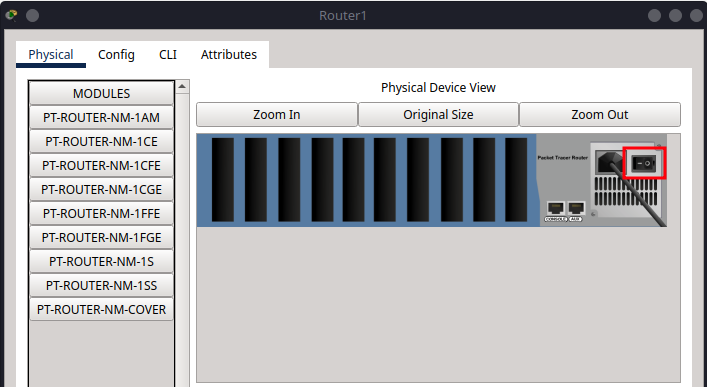
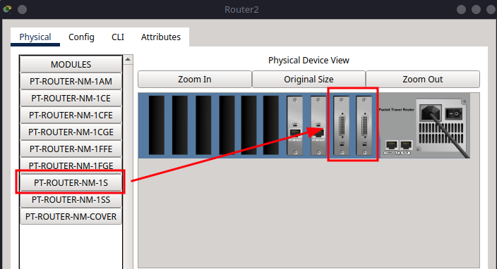
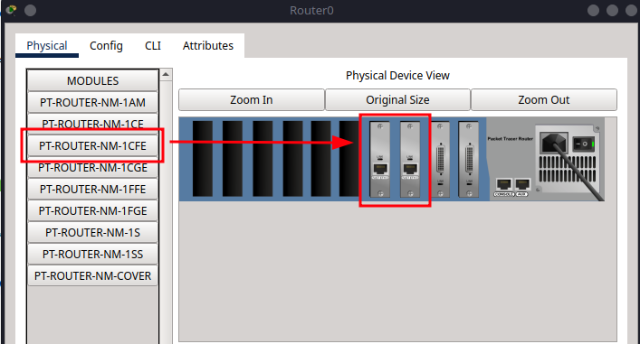

# 11 - Configuring OSPF Routing in Cisco Packet Tracer

This tutorial is the eleventh in our Cisco Packet Tracer series and focuses on **OSPF (Open Shortest Path First)**, a **link-state dynamic routing** protocol. Unlike RIP, OSPF supports larger networks, faster convergence, and more efficient routing decisions using cost metrics based on bandwidth.

We’ll extend our previous three-router topology by adding an extra link between R0 and R2, configure OSPF across all routers, and verify dynamic routing.

If you're after a different routing protocol, check out -

- [Tutorial 9: Configuring Static Routing in Packet Tracer](../tutorial-series/tutorial9.md)
- [Tutorial 10: Configuring RIP Routing in Packet Tracer](../tutorial-series/tutorial10.md)
- [Tutorial 11: Configuring OSPF Routing in Packet Tracer](../tutorial-series/tutorial11.md)
- [Tutorial 12: Configuring EIGRP Routing in Packet Tracer](../tutorial-series/tutorial12.md)

---

## Part 1 – Network Topology Overview

This network includes:

* **Three routers (R1, R2, R3)** all connected to each other
* **Three switches (S1, S2, S3)** – one per router
* **Two PCs per switch** (6 total PCs)

The goal is to enable all PCs to communicate through OSPF-configured routers.


---

## Part 2 – Device Placement and Cabling

### Step 2.1 – Add Devices to the Workspace

From **Network Devices** and **End Devices**, place:

* **3 Routers** (Router-PT-Empty)
* **3 Switches** (2960)
* **6 PCs**

Label the devices:

* Routers: **R0**, **R1**, **R2**
* Switches: **S0**, **S1**, **S2**
* PCs: **PC0–PC5**

### Step 2.2 – Add Network Modules to Routers

For this topology, use **Router-PT-Empty** devices. Each router needs **two Serial** and **two FastEthernet** interfaces to support all required connections.

Follow these steps for **R0**, **R1**, and **R2**:

1. Click the router to open its configuration window.
2. Go to the **Physical** tab.
3. Click the **power button** to turn off the router (the green light will go out).
   
4. In the module area, locate **PT-ROUTER-NM-1S** (Serial Port) and **PT-ROUTER-NM-1CFE** (FastEthernet).
5. Drag and insert **two** PT-ROUTER-NM-1S modules into the first two empty slots (from right to left).
   
6. Drag and insert **two** PT-ROUTER-NM-1CFE modules into the next two empty slots.
   
7. Click the **power button** again to turn the router back on.
   

### Step 2.2 – Cabling

Now we will connect the devices using appropriate cables:

```{admonition} Note
:class: note
For clarity and future expansion, I recommend connecting the switch to the router using the last available port on the switch (for example, fa0/24). This keeps the lower-numbered ports free for connecting PCs and other end devices.
```

#### **Copper Straight-Through Connections**

| From   | To   | Port/Interface         |
|--------|------|------------------------|
| PC0    | S1   | fa0/1                  |
| PC1    | S1   | fa0/2                  |
| S1     | R0   | fa0/24 → fa2/0         |
| PC2    | S2   | fa0/1                  |
| PC3    | S2   | fa0/2                  |
| S2     | R1   | fa0/24 → fa2/0         |
| PC4    | S3   | fa0/1                  |
| PC5    | S3   | fa0/2                  |
| S3     | R2   | fa0/24 → fa2/0         |

#### **Serial DTE Connections**

| From | To | Port/Interface    |
|------|----|-------------------|
| R0   | R1 | se0/0 ↔ se1/0     |
| R1   | R2 | se0/0 ↔ se1/0     |
| R0   | R2 | se1/0 ↔ se0/0     |


---

## Part 3 – IP Addressing Scheme

Now we will assign IP addresses to all devices, ensuring they can communicate across the network.

### Subnet Allocation

For this tutorial, we will use the following subnets:

| Subnet         | Devices      | Subnet Mask     |
| -------------- | ------------ | --------------- |
| 192.168.1.0/24 | PC0, PC1, R0 | 255.255.255.0   |
| 192.168.2.0/24 | PC2, PC3, R1 | 255.255.255.0   |
| 192.168.3.0/24 | PC4, PC5, R2 | 255.255.255.0   |
| 10.0.0.0/30    | R0 ↔ R1      | 255.0.0.0 |
| 11.0.0.0/30    | R1 ↔ R2      | 255.0.0.0 |
| 12.0.0.0/30    | R0 ↔ R2      | 255.0.0.0 |

### Step 3.1 – Assign IPs to PCs

Go to **Desktop > IP Configuration** on each PC:

| PC   | IP Address      | Subnet Mask     | Default Gateway   |
|------|-----------------|-----------------|-------------------|
| PC0  | 192.168.1.10    | 255.255.255.0   | 192.168.1.1       |
| PC1  | 192.168.1.11    | 255.255.255.0   | 192.168.1.1       |
| PC2  | 192.168.2.12    | 255.255.255.0   | 192.168.2.1       |
| PC3  | 192.168.2.13    | 255.255.255.0   | 192.168.2.1       |
| PC4  | 192.168.3.14    | 255.255.255.0   | 192.168.3.1       |
| PC5  | 192.168.3.15    | 255.255.255.0   | 192.168.3.1       |


---

## Part 4 – Router Configuration

Each router in this network handles two types of connections:

- LAN-side via FastEthernet2/0, connected to a local switch
- WAN-side via Serial interfaces, connected to neighbouring routers
- All routers will be configured with OSPF routing

```{admonition} Note
:class: note
The OSPF routing configuration is performed using the following steps in the CLI:

1. Enter OSPF configuration mode:
    ```
    router ospf 1
    ```
    Here, `1` is the OSPF process ID (can be any number).

2. Specify which networks to advertise and the OSPF area:
    ```
    network 192.168.1.0 0.0.0.255 area 0
    network 10.0.0.0 0.255.255.255 area 0
    ```
    - The first parameter is the network address.
    - The second is the wildcard mask (inverse of subnet mask).
    - The last specifies the OSPF area (commonly `0` for backbone).

These commands enable the router to participate in OSPF, automatically exchanging routing information with other OSPF-enabled routers for the specified networks.
```

### Step 4.1 – R0 Configuration

```{admonition} Tip
:class: tip
The shorthand for `configure terminal` is `conf t`, which can save time when entering commands.
```

```bash
enable
configure terminal
hostname R0

interface fa2/0
ip address 192.168.1.1 255.255.255.0
no shutdown
exit

interface se0/0
ip address 10.0.0.1 255.0.0.0
clock rate 64000
no shutdown
exit

interface se1/0
ip address 12.0.0.1 255.0.0.0
clock rate 64000
no shutdown
exit

router ospf 1
network 192.168.1.0 0.0.0.255 area 0
network 10.0.0.0 0.255.255.255 area 0
network 12.0.0.0 0.255.255.255 area 0
exit
exit

write memory
exit
```

### Step 4.2 – R1 Configuration

```bash
enable
configure terminal
hostname R1

interface fa2/0
ip address 192.168.2.1 255.255.255.0
no shutdown
exit

interface se1/0
ip address 10.0.0.2 255.0.0.0
no shutdown
exit

interface se0/0
ip address 11.0.0.1 255.0.0.0
clock rate 64000
no shutdown
exit

router ospf 1
network 192.168.2.0 0.0.0.255 area 0
network 10.0.0.0 0.255.255.255 area 0
network 11.0.0.0 0.255.255.255 area 0
exit
exit

write memory
exit
```

### Step 4.3 – R2 Configuration

```bash
enable
configure terminal
hostname R2

interface fa2/0
ip address 192.168.3.1 255.255.255.0
no shutdown
exit

interface se1/0
ip address 11.0.0.2 255.0.0.0
no shutdown
exit

interface se0/0
ip address 12.0.0.2 255.0.0.0
no shutdown
exit

router ospf 1
network 192.168.3.0 0.0.0.255 area 0
network 11.0.0.0 0.255.255.255 area 0
network 12.0.0.0 0.255.255.255 area 0
exit
exit

write memory
exit
```


---

## Part 5 – Verification and Testing

So now your network should be fully configured with OSPF routing. The next step is to verify that all devices can communicate across the network.


### Step 5.1 – Check Routing Tables

Run on each router:

```bash
show ip route
```

You should see OSPF routes (`O`) to all remote networks.


You can specifically specify this by running:

```bash
show ip route O
```


This command will filter the routing table to show only OSPF routes, making it easier to verify that all networks are reachable.

### Step 5.2 – Test Connectivity

From **PC0**, run:

```bash
ping 192.168.1.11
ping 192.168.2.12
ping 192.168.3.14
```


From **PC3**, ping **PC5**:

```bash
ping 192.168.3.15
```


Repeat pings between any devices across networks.

---

## Summary

In this tutorial, you:

* Built a three-router, three-switch network with six PCs
* Assigned IPs and default gateways to all devices
* Configured OSPF routing on each router
* Verified full network reachability using dynamic routing
