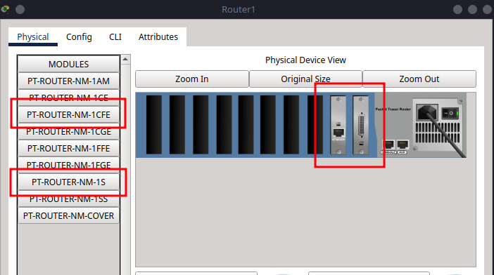
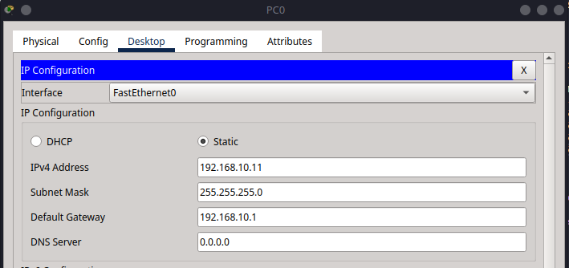
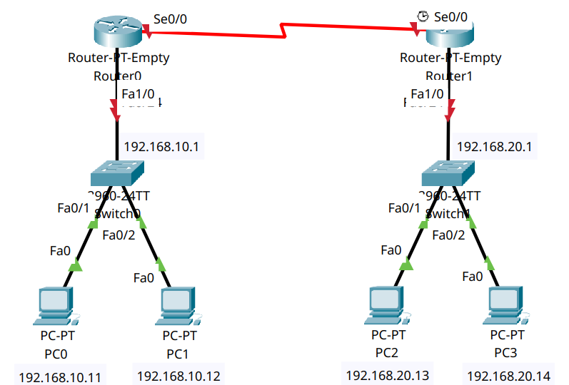
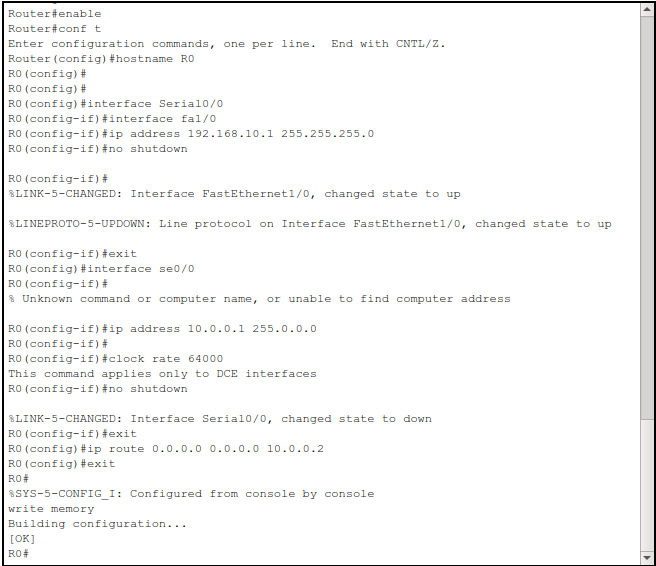
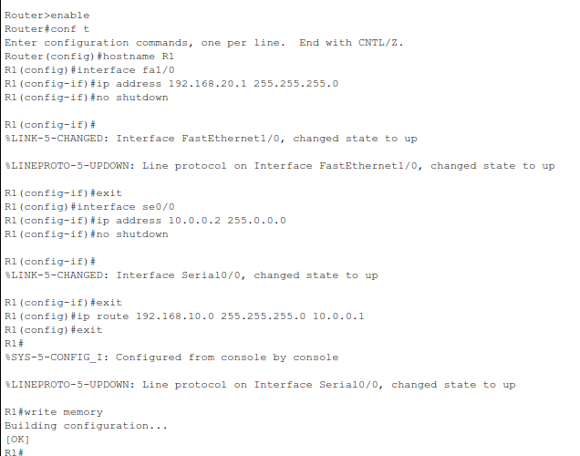
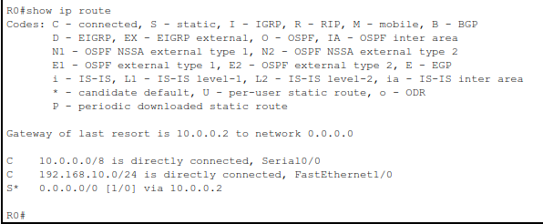
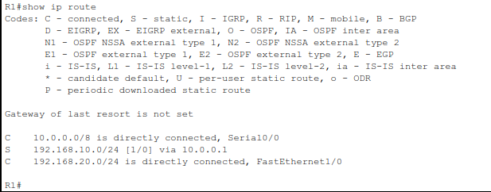
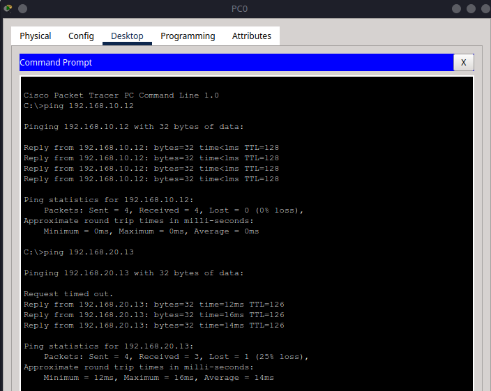
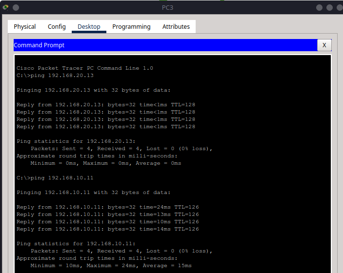

# 13 – Configuring a Default Route (Gateway of Last Resort)

This tutorial is the thirteenth in our Cisco Packet Tracer series and focuses on **default routing**—also known as configuring a **gateway of last resort**. This type of route is essential in smaller or **stub networks**, where routers only have one exit path for unknown destinations.

We will build a small branch-office style topology and configure the branch router to forward all unknown traffic to a main router using a static default route.

Find the CISCO pkt files in the repo -


---

## Part 1 – Network Topology Overview

This network includes:

* **Two routers** (R0 = Branch, R1 = Main)
* **One switch per router** (S0, S1)
* **Two PCs per switch** (4 total PCs)

The branch site will have no knowledge of external networks, so it will use R1 as its **gateway of last resort**.



---

## Part 2 – Device Placement and Cabling

### Step 2.1 – Add Devices to the Workspace

From **Network Devices** and **End Devices**, place:

* **2 Routers** (Router-PT-Empty)
* **2 Switches** (2960)
* **4 PCs**

Label the devices:

* Routers: **R0** (Branch), **R1** (Main)
* Switches: **S0** (for R0), **S1** (for R1)
* PCs: **PC0–PC3**

### Step 2.2 – Add Network Modules to Routers

Add:

* **1x PT-ROUTER-NM-1S**
* **1x PT-ROUTER-NM-1CFE**

Turn off each router, insert modules, then power back on.

If you need help with this, refer to the steps in [How to Customise the Router-PT in Packet Tracer](../handy-tips/tip5.md)


### Step 2.3 – Cabling

Use **Copper Straight-Through** for PC to switch and switch to router connections. Use **Serial DCE** for the R0 ↔ R1 link.

| From | To | Port/Interface |
| ---- | -- | -------------- |
| PC0  | S0 | fa0/1          |
| PC1  | S0 | fa0/2          |
| S0   | R0 | fa0/24 → fa2/0 |
| PC2  | S1 | fa0/1          |
| PC3  | S1 | fa0/2          |
| S1   | R1 | fa0/24 → fa2/0 |
| R0   | R1 | se0/0 ↔ se0/0  |

---

## Part 3 – IP Addressing Scheme

Now we will assign IP addresses to all devices, ensuring they can communicate across the network.

### Subnet Allocation

For this tutorial, we will use the following subnets:

| Subnet          | Devices      | Subnet Mask   |
| --------------- | ------------ | ------------- |
| 192.168.10.0/24 | PC0, PC1, R0 | 255.255.255.0 |
| 192.168.20.0/24 | PC2, PC3, R1 | 255.255.255.0 |
| 10.0.0.0/30     | R0 ↔ R1      | 255.0.0.0     |

### Assign IPs to PCs

Go to **Desktop > IP Configuration** on each PC:

| PC  | IP Address   | Subnet Mask   | Default Gateway |
| --- | ------------ | ------------- | --------------- |
| PC0 | 192.168.10.11 | 255.255.255.0 | 192.168.10.1     |
| PC1 | 192.168.10.12 | 255.255.255.0 | 192.168.10.1     |
| PC2 | 192.168.20.13 | 255.255.255.0 | 192.168.20.1     |
| PC3 | 192.168.20.14 | 255.255.255.0 | 192.168.20.1     |





---

## Part 4 – Router Configuration

In this part, we will configure the routers to enable communication between the PCs and set up a default route on R0.

```{admonition} Note
:class: note
To ensure all unknown traffic from the branch site is forwarded to the main router, we configure a default route on R0. This is done with the command `ip route 0.0.0.0 0.0.0.0 10.0.0.2`, which instructs R0 to send any traffic destined for networks it doesn't know about to R1. On R1, we add a static route pointing back to the branch network, allowing two-way communication.
```

### Step 4.1 – R0 (Branch Router)

```bash
enable
configure terminal
hostname R0

interface fa1/0
ip address 192.168.10.1 255.255.255.0
no shutdown
exit

interface se0/0
ip address 10.0.0.1 255.0.0.0
clock rate 64000
no shutdown
exit

ip route 0.0.0.0 0.0.0.0 10.0.0.2
exit
write memory
```

> This is the **default route**. It says: "Send all unknown traffic to `10.0.0.2` (R1)."



### Step 4.2 – R1 (Main Router)

```bash
enable
configure terminal
hostname R1

interface fa1/0
ip address 192.168.20.1 255.255.255.0
no shutdown
exit

interface se0/0
ip address 10.0.0.2 255.0.0.0
no shutdown
exit

ip route 192.168.10.0 255.255.255.0 10.0.0.1
exit
write memory
```



---

## Part 5 – Verification and Testing

### Step 5.1 – Check Routing Tables

On **R0**:

```bash
show ip route
```

You should see a route labeled with `S*` – this is the static default route.



On **R1**:

```bash
show ip route
```

You should see a static route to `192.168.10.0` via `10.0.0.1`



### Step 5.2 – Ping Tests

From **PC0**, try:

```bash
ping 192.168.20.10
ping 192.168.20.13
```



From **PC3**, try:

```bash
ping 192.168.20.13
ping 192.168.10.11
```



---

## Summary

In this tutorial, you:

* Created a simple two-router topology
* Assigned IP addresses and connected all devices
* Configured a **default route** on the branch router
* Verified full connectivity using `ping` and `show ip route`

Default routes are vital in small or remote networks where only one path leads to the rest of the network or the internet.
