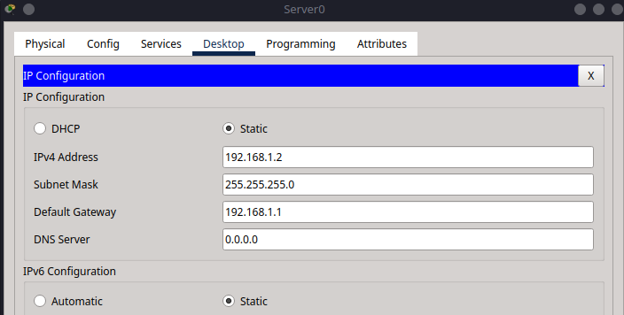

# 14 – DHCP Server Configuration in Cisco Packet Tracer

This tutorial is the fourteenth in our Cisco Packet Tracer series and introduces the configuration of a **DHCP (Dynamic Host Configuration Protocol) server**. DHCP automates IP address assignment, simplifying host configuration in networks of all sizes.

We’ll build a basic network with **one router, two switches, six PCs**, and **one DHCP server**. The DHCP server will dynamically assign IP addresses to all PCs in the network.

---

## Part 1 – Network Topology Overview

This network includes:

* **One router** (R0)
* **Two switches** (S0, S1)
* **Six PCs** (PC0–PC5)
* **One server** (Server0) acting as the DHCP server, connected to Switch 0


---

## Part 2 – Device Placement and Cabling

### Step 2.1 – Add Devices to the Workspace

From **Network Devices** and **End Devices**, place:

* **1 Router** (2911)
* **2 Switches** (2960)
* **6 PCs** (PC0–PC5)
* **1 Server** (Server0)

Label as follows:

* Router: **R0**
* Switches: **S0**, **S1**
* Server: **Server0** (DHCP)
* PCs: **PC0–PC5**


### Step 2.2 – Cabling

Use **Copper Straight-Through** connections:

| From    | To | Port           |
| ------- | -- | -------------- |
| PC0–PC2 | S0 | fa0/1–fa0/3    |
| Server0 | S0 | fa0/23         |
| PC3–PC5 | S1 | fa0/1–fa0/3    |
| S0      | R0 | fa0/24 → gig0/0 |
| S1      | R0 | fa0/24 → gig0/1 |

---

## Part 3 – IP Addressing Plan

We’ll configure **two subnets**, one per switch:

| Subnet         | Range             | Subnet Mask   |
| -------------- | ----------------- | ------------- |
| 192.168.1.0 | Switch S0 (VLAN1) | 255.255.255.0 |
| 192.168.2.0 | Switch S1 (VLAN2) | 255.255.255.0 |

Router interfaces:

| Device | Interface | IP Address  |
| ------ | --------- | ----------- |
| R0     | gig0/0     | 192.168.1.1 |
| R0     | gig0/1     | 192.168.2.1 |

The DHCP server will provide addresses within:

* 192.168.1.10–192.168.1.100 for VLAN 1 (Switch 0)
* 192.168.2.10–192.168.2.100 for VLAN 2 (Switch 1)

---

## Part 4 – Configuration

Now we will configure the DHCP server and router interfaces to enable automatic IP address assignment. It's important to ensure the DHCP server is reachable from both VLANs and therefore we will set it up first.

### Step 4.1 – Configure the DHCP Server

1. Click on **Server0**
2. Go to the **Desktop** tab → Select **IP Configuration**
3. Set the following values:
    * **IPv4 Address:** `192.168.1.2`
    * **Subnet Mask:** `255.255.255.0`
    * **Default Gateway:** `192.168.1.1`

     

     > This ensures the DHCP server has a fixed IP address on the correct subnet and can communicate with the router.
4. Now go to the **Services** tab
5. From the left menu, select **DHCP**
6. Make sure **Service** is turned **On** at the top

```{admonition} Warning
:class: warning
Ensure to turn on the `ServerPool` service in the DHCP settings, but don't change any of its default settings.
```

#### Configure the first pool (for Switch 0 / VLAN 1)-

* **Pool Name:** `LAN1`
* **Default Gateway:** `192.168.1.1`
* **DNS Server:** `0.0.0.0`
* **Start IP Address:** `192.168.1.10`
* **Subnet Mask:** `255.255.255.0`
* **Maximum Number of Users:** `90`
* Click **Add**


#### Configure the second pool (for Switch 1 / VLAN 2)-

* **Pool Name:** `LAN2`
* **Default Gateway:** `192.168.2.1`
* **DNS Server:** `0.0.0.0`
* **Start IP Address:** `192.168.2.10`
* **Subnet Mask:** `255.255.255.0`
* **Maximum Number of Users:** `90`
* Click **Add**


> You should now see both pools listed in the table at the bottom, showing their assigned configurations.
>
> 

### Step 4.2 – Configure Router Interfaces

```{admonition} Note
:class: note
We will be configuring the DHCP server to have the IP address `192.168.1.2` and we will use the `ip helper-address` command to forward DHCP requests from VLAN 2 to the DHCP server.
```

```bash
enable
configure terminal
hostname R0

interface g0/0
ip address 192.168.1.1 255.255.255.0
no shutdown
exit

interface g0/1
ip address 192.168.2.1 255.255.255.0
ip helper-address 192.168.1.2
no shutdown
exit

ip dhcp relay information trust-all
exit
write memory
```


---

## Part 5 – PC Configuration and Testing

Your network is now set up with a DHCP server and router. The next step is to configure the PCs to use DHCP for automatic IP address assignment.


### Step 5.1 – Set PCs to Use DHCP

1. Click on each PC (PC0–PC5)
2. Go to **Desktop** > **IP Configuration**
3. Select **DHCP** (not static)

Each PC should automatically receive an IP address, subnet mask, default gateway, and DNS server.


### Step 5.2 – Verify Connectivity

From **PC0**, ping **PC3**:

```{admonition} Note
:class: note
Make sure to check the IP address of PC3 before pinging as it may vary based on the DHCP assignment.

```bash
ping 192.168.2.32
```


From **PC5**, ping the DHCP server:

```bash
ping 192.168.1.2
```


You can also run:

```bash
ipconfig /all
```

> This displays the IP address, gateway, and DNS settings assigned by DHCP.
>
> 

---

## Summary

In this tutorial, you:

* Built a two-switch, single-router network
* Connected a DHCP server to automatically manage IP addresses
* Configured two IP subnets for different LAN segments
* Verified automatic address assignment using DHCP

DHCP simplifies network management by removing the need to manually assign IP addresses to each device—especially valuable in larger or frequently changing networks.
