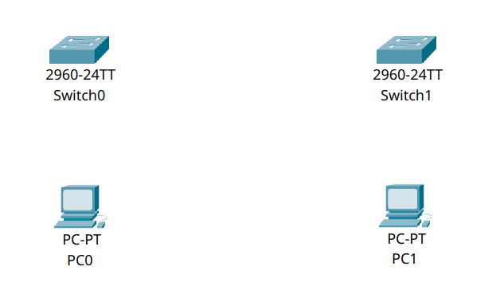

# 2 – Configuring Multi-Switch Communication  

This tutorial is the second in a series focused on Cisco networking concepts, specifically using Cisco Packet Tracer. In this lesson, we will connect two PCs through two switches, demonstrating key concepts such as port activation, MAC address learning, and VLAN configuration.

## Connecting Two PCs Through Two Switches in Cisco Packet Tracer

In this tutorial, we’ll explore how to connect two end devices (PCs) through a chain of **two switches**. While this setup does not require IP routing, it introduces important switching concepts such as **port activation**, **MAC address learning**, and proper **VLAN configuration**.

This scenario is common in enterprise environments where multiple switches form the backbone of a local area network (LAN). Understanding how switches interact is essential to building reliable and scalable network infrastructures.

---

## Part 1 – Network Topology Overview

We will build the following topology:

```bash
\[PC0] ── \[Switch0] ── \[Switch1] ── \[PC1]
```

Each device will be configured with a static IP address in the same subnet, and we’ll ensure the switches allow Layer 2 traffic to pass between them seamlessly.


---

## Part 2 – Device Placement and Cabling

### Step 2.1 – Add Devices

1. Drag **two PCs** (e.g. *PC0* and *PC1*) into the workspace.
2. Add **two switches** (*Switch0* and *Switch1*, model 2960 recommended).



### Step 2.2 – Connect Devices

Use **Copper Straight-Through** cables to make the following connections:

- **PC0** → **Switch0**, using `FastEthernet0`
- **Switch0** → **Switch1**, using `FastEthernet0/24` on both switches
- **Switch1** → **PC1**, using `FastEthernet0`


---

## Part 3 – Configure IPv4 Addresses

We will assign static IP addresses to both PCs.

### Step 3.1 – PC0 IPv4 Settings

1. Click on **PC0**.
2. Go to **Desktop** → **IP Configuration**.
3. Enter:
   - IP Address: `192.168.20.1`
   - Subnet Mask: `255.255.255.0`


### Step 3.2 – PC1 IPv4 Settings

1. Click on **PC1**.
2. Go to **Desktop** → **IP Configuration**.
3. Enter:
   - IP Address: `192.168.20.2`
   - Subnet Mask: `255.255.255.0`


---

## Part 4 – Configuring Switch Ports

By default, Cisco switches have all ports assigned to **VLAN 1** and are administratively up, but sometimes ports need to be explicitly **activated**.

We will:

- Confirm all ports are operational
- Ensure all involved ports are assigned to the same VLAN
- Manually enable interfaces if needed

---

### Step 4.1 – Configure Switch0

1. Click on **Switch0**, go to the **CLI** tab.
2. Enter the following commands:

   ```bash
   enable
   configure terminal

   interface range fa0/1, fa0/24
   switchport mode access
   switchport access vlan 1
   no shutdown
   exit

   end
   write memory
    ```

This ensures:

- Port `fa0/1` (to PC0) and `fa0/24` (to Switch1) are active
- Both are assigned to **VLAN 1**


---

### Step 4.2 – Configure Switch1

1. Click on **Switch1**, go to the **CLI** tab.
2. Enter:

   ```bash
   enable
   configure terminal

   interface range fa0/1, fa0/24
   switchport mode access
   switchport access vlan 1
   no shutdown
   exit

   end
   write memory
   ```

Again:

- Port `fa0/1` (to PC1) and `fa0/24` (from Switch0) are active
- VLAN 1 is used for untagged traffic across the switches


---

## Part 5 – Testing Connectivity

To verify that switching is working:

1. On **PC0**, open the **Command Prompt**.
2. Ping PC1:

   ```bash
   ping 192.168.20.2
   ```

You should receive successful replies.

If not, double-check:

- All interfaces on both switches are **no shutdown**
- All ports are on the **same VLAN**
- PC IP addresses are correct and in the same subnet
- Cabling is correct


---

## Summary

In this tutorial, you have:

- Connected two PCs across two switches
- Assigned static IPv4 addresses in the same subnet
- Verified port activation and VLAN assignment on switches
- Successfully tested communication across a multi-switch setup
