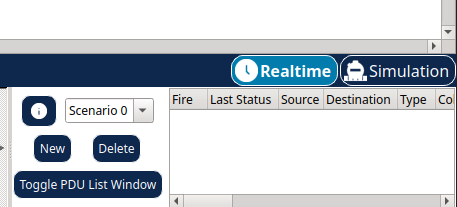
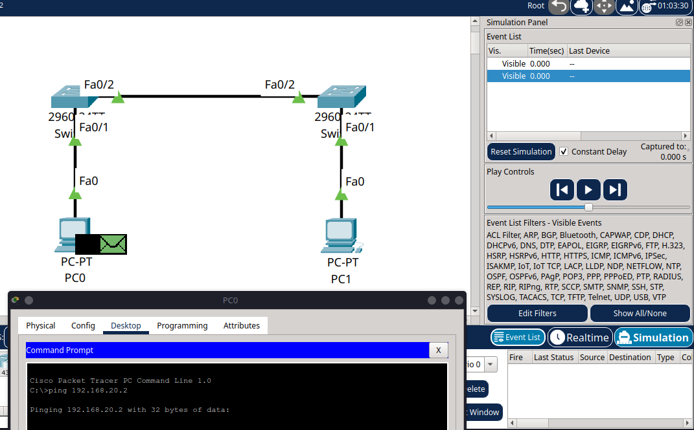
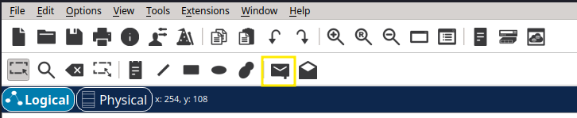
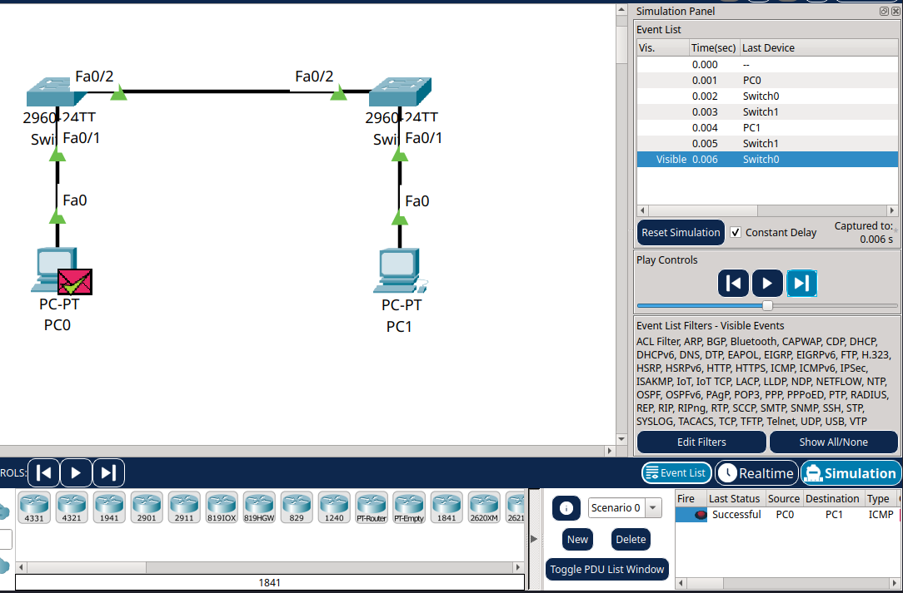
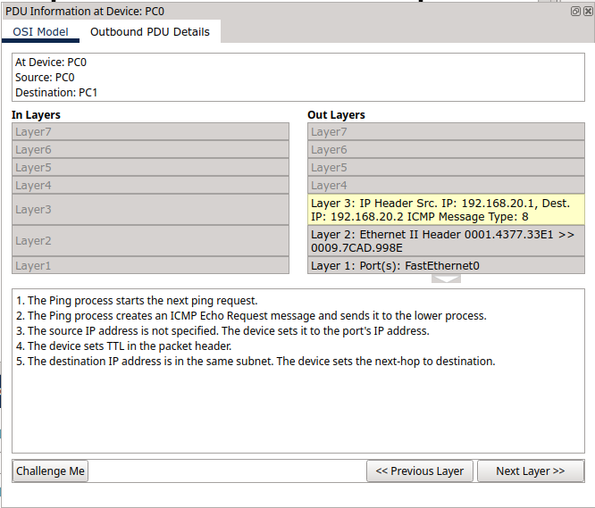
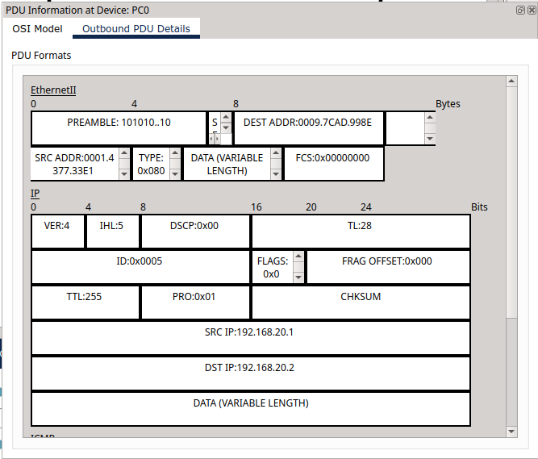

# Tutorial 3 – Exploring Simulation Mode in Cisco Packet Tracer

This tutorial continues from where we left off in [Tutorial 2](../cisco/tutorial-series/tutorial2). You’ve successfully connected two PCs through two switches, now it’s time to **see how the data actually travels** using **Simulation Mode** in Cisco Packet Tracer.

Simulation Mode lets you observe network activity step by step. It’s a powerful learning tool that helps you understand what happens during ARP requests, pings, and frame forwarding across switches.

---

## Part 1 – What Is Simulation Mode?

**Simulation Mode** slows down network traffic so you can see exactly what’s happening. It allows you to:

* Watch ARP (Address Resolution Protocol) in action
* Follow ping (ICMP) packets across the network
* See how switches forward frames based on MAC addresses
* Inspect each packet at different OSI layers

Think of it as a slow-motion replay for your network.

---

## Part 2 – Switching to Simulation Mode

1. **Open your existing project** from Tutorial 2 in Cisco Packet Tracer.
2. In the bottom-right corner, change from **Real-Time** to **Simulation**.

   

---

## Part 3 – Setting Up a Ping Test

### Step 3.1 – Double-Check Device Setup

Make sure you're using the same devices and connections as in Tutorial 2.

### Step 3.2 – Start the Ping

You can initiate a ping in **two different ways**.

#### **Option 1 – Use the Command Prompt**

1. Click on **PC0**.
2. Open the **Desktop** tab and select **Command Prompt**.
3. Type:

   ```bash
   ping 192.168.20.2
   ```

   

   The ping won’t happen immediately, this is expected in **Simulation Mode**.

#### **Option 2 – Use the Envelope Button (Simple PDU)**

1. Click the **envelope icon** in the bottom-right corner, labelled **"Add Simple PDU"** (see **Figure 6**).
2. Click on **PC0**, then on **PC1** to set up a basic ping between them.

   

---

After using either method, press the **"Capture / Forward"** button repeatedly to move through each step of the simulation.



---

## Part 4 – Watching the Packets Move

You’ll see the following sequence in the **Event List**:

1. **ARP Request** from PC0 asking who has `192.168.20.2`
2. Switch0 broadcasts the request
3. Switch1 forwards it to PC1
4. PC1 responds with its MAC address
5. PC0 updates its ARP table
6. The ping (ICMP Echo Request) is sent
7. PC1 replies with an ICMP Echo Reply

Click on any event in the list, then click **"PDU Information"** to see detailed info across the OSI layers.





---

## Part 5 – Using Protocol Filters

To make things clearer, you can filter the protocols shown:

1. In the **Event List Filters** on the right, tick or untick protocols like:

   * ARP
   * ICMP
   * DNS, HTTP (if you're testing other traffic later)

This helps you focus on what’s relevant.

---

## Part 6 – Checking the ARP Table

You can confirm that MAC addresses have been learned by using the ARP table:

* On **PC0**, open the **Command Prompt** and type:

  ```bash
  arp -a
  ```

* You should now see the IP and MAC address of PC1 listed.

---

## Summary

In this tutorial, you:

- Switched from Real-Time to Simulation Mode in Cisco Packet Tracer
- Initiated and observed a ping between two PCs
- Watched ARP requests and ICMP packets move through the network, step by step
- Saw how switches forward frames based on MAC addresses
- Explored detailed protocol information at each OSI layer using simulation tools
