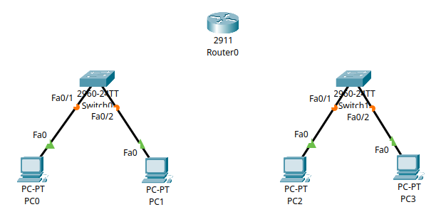
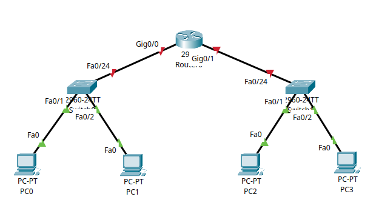
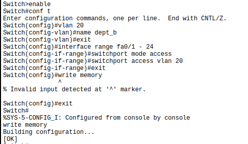
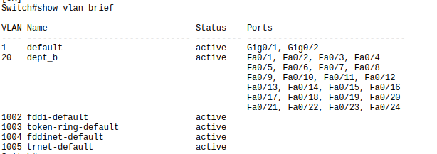
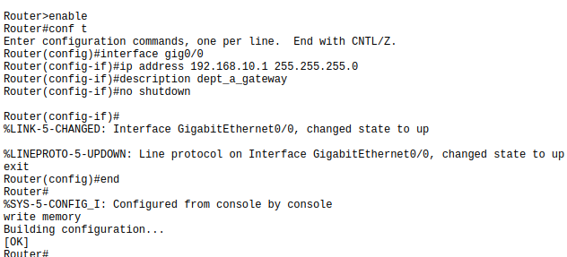
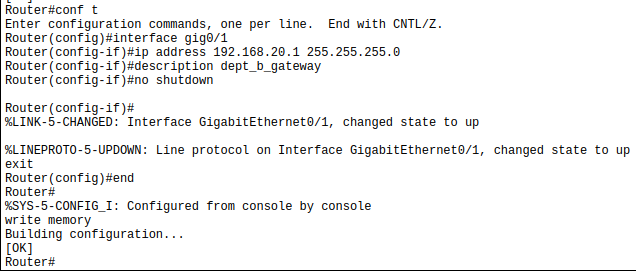
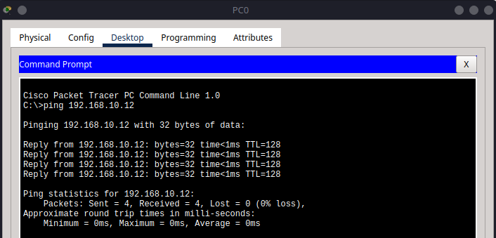
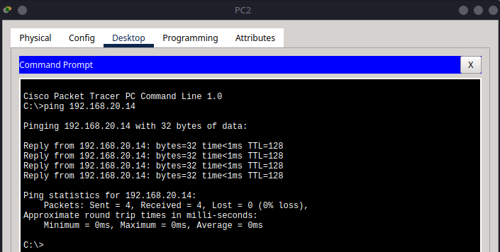
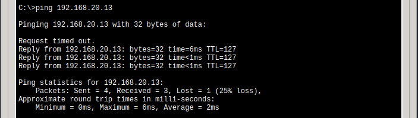

# 4 – Inter-VLAN Routing (Router-on-a-Stick)

This tutorial is the fourth in our series on Cisco Packet Tracer, focusing on **inter-VLAN routing** using a **Router-on-a-Stick (ROAS)** configuration. This method allows a single router to route traffic between multiple VLANs by using subinterfaces.

## Using Subinterfaces to Route Between VLANs in Cisco Packet Tracer

In this tutorial, we’ll walk through a complete setup of **inter-VLAN routing** using a **Router-on-a-Stick (ROAS)** topology. This is a core concept in modern enterprise networks, where multiple **VLANs (Virtual LANs)** are used to segment traffic, and a single router is used to enable communication between them.

We will:

* Create VLANs for different groups of users
* Assign switchports to VLANs
* Use **router subinterfaces** to route between VLANs
* Verify everything with ping and `ipconfig`

---

## Part 1 – Understanding the Topology

This lab simulates a small business network divided into two departments, each with its own VLAN:

* **Department A (VLAN 10):** PC1 and PC2
* **Department B (VLAN 20):** PC3 and PC4

The network topology is designed to demonstrate how inter-VLAN routing is achieved using a single router (Router-on-a-Stick). The physical and logical connections are as follows:

```bash
           +---------+         +---------+         +---------+
PC0 -------|         |         |         |         |         |------- PC2
           | Switch0 |--- fa0/1| Router0 |fa0/2 ---| Switch1 |
PC1 -------|         |         |         |         |         |------- PC3
           +---------+         +---------+         +---------+
```

### Key Concepts Covered

* **VLANs (Virtual LANs):** Used to logically segment the network at Layer 2, isolating broadcast domains and improving security and performance.
* **Router Subinterfaces:** Logical interfaces configured on a single physical router port, each assigned to a specific VLAN, allowing the router to route traffic between VLANs.


---

## Part 2 – Device Setup and Cabling

### Step 2.1 – Selecting and Placing Devices

In Cisco Packet Tracer, select and place the following devices on your workspace:

* **Router:** Cisco 2911 (or a similar model that supports subinterfaces)
* **Switches:** Two Cisco 2960 switches (Switch0 and Switch1)
* **End Devices:** Four generic PCs (PC0, PC1, PC2, PC3)

#### Labelling and Placement Guidelines

* Place **Switch0** and **Switch1** near the center of your workspace.
* Position **Router0** between the two switches to represent its central role in routing.
* Place **PC0** and **PC1** near **Switch0**.
* Place **PC2** and **PC3** near **Switch1**.
* Clearly label each device for easy identification.


---

### Step 2.2 – Cabling the Network

#### Connecting End Devices to Switches

Use **Copper Straight-Through** cables for all device-to-switch connections:

* **PC0** to `fa0/1` on **Switch0**
* **PC1** to `fa0/2` on **Switch0**
* **PC2** to `fa0/1` on **Switch1**
* **PC3** to `fa0/2` on **Switch1**



#### Connecting Switches to Router

Use **Copper Straight-Through** cables for switch-to-router connections:

* **Switch0** `fa0/24` to **Router0** `gig0/0`
* **Switch1** `fa0/24` to **Router0** `gig0/1`

```{admonition} Note
:class: note
For clarity and future expansion, I recommend connecting the switch to the router using the last available port on the switch (for example, fa0/24). This keeps the lower-numbered ports free for connecting PCs and other end devices.
```



#### Cabling Tips

* Double-check that each PC is connected to the correct switch port.
* Avoid using crossover cables; straight-through is standard for these connections in Packet Tracer.

```{admonition} Note
:class: note
Proper device placement and accurate cabling are crucial for the success of the lab. If you encounter connectivity issues later, revisit this section to verify your setup.
```

---

## Part 3 – VLAN Configuration and Port Assignment

In this section, you’ll configure VLANs, assign access ports, and save the configuration on each switch.

---

### On Switch0 (Department A)

1. Enter privileged EXEC mode and global configuration mode:

   ```bash
   enable
   configure terminal
   ```

2. Create VLAN 10 and name it:

   ```bash
   vlan 10
   name Dept_A
   exit
   ```

3. Assign all access ports on the switch (e.g., `fa0/1` to `fa0/24`) to VLAN 10:

   ```bash
   interface range fa0/1 - 24
   switchport mode access
   switchport access vlan 10
   exit
   exit
   write memory
   ```

   

4. Verify VLAN configuration:

   ```bash
   show vlan brief
   ```

   

---

### On Switch1 (Department B)

1. Enter privileged EXEC mode and global configuration mode:

   ```bash
   enable
   configure terminal
   ```

2. Create VLAN 20 and name it:

   ```bash
   vlan 20
   name Dept_B
   exit
   ```

3. Assign all access ports on the switch (e.g., `fa0/1` to `fa0/24`) to VLAN 20:

   ```bash
   interface range fa0/1 - 24
   switchport mode access
   switchport access vlan 20
   exit
   exit
   write memory
   ```

   

4. Verify VLAN configuration:

   ```bash
   show vlan brief
   ```

   

---

```{admonition} Note
:class: note
If you encounter issues later, revisit these steps to confirm your VLAN and port assignments are correct.
```

---

## Part 4 – Router Interface Configuration (No Subinterfaces)

Instead of using subinterfaces and trunk links (we will cover this in a later tutorial), we configure one **physical router interface per VLAN**. Each router interface connects to a switch access port that carries a single VLAN.

### Step 4.1 – Configure Router Interfaces on Router0

Start by entering into the cli of **Router0**:

```bash
enable
conf t
```

#### For VLAN 10 (Department A):

Then configure the interface for VLAN 10:

```bash
interface gig0/0
ip address 192.168.10.1 255.255.255.0
description Dept_A_Gateway
no shutdown
exit

end
write memory
```



#### For VLAN 20 (Department B):

Next, configure the interface for VLAN 20:

```bash
conf t
interface gig0/1
ip address 192.168.20.1 255.255.255.0
description Dept_B_Gateway
no shutdown
exit

end
write memory
```



No VLAN encapsulation is needed because each interface handles only one VLAN.

---

## Part 5 – Configure PC IP Settings

Each PC needs a static IP address and default gateway to enable communication within and across VLANs.

### Step 5.1 – Configure PC0 IPv4 Settings

1. Click on **PC0**.
2. Navigate to **Desktop** → **IP Configuration**.
3. Enter the following:

   * **IP Address**: `192.168.10.11`
   * **Subnet Mask**: `255.255.255.0`
   * **Default Gateway**: `192.168.10.1`


---

### Step 5.2 – Repeat for the Other PCs

Use the table below to configure the remaining devices:

| PC  | VLAN    | IP Address      | Subnet Mask     | Default Gateway |
| --- | ------- | --------------- | --------------- | --------------- |
| PC0 | VLAN 10 | `192.168.10.11` | `255.255.255.0` | `192.168.10.1`  |
| PC1 | VLAN 10 | `192.168.10.12` | `255.255.255.0` | `192.168.10.1`  |
| PC2 | VLAN 20 | `192.168.20.13` | `255.255.255.0` | `192.168.20.1`  |
| PC3 | VLAN 20 | `192.168.20.14` | `255.255.255.0` | `192.168.20.1`  |

Repeat **Step 5.1** on each PC, entering the values from the table above.

All PCs should now be configured with their respective IP addresses and gateways, and all arrows should be green, indicating successful configuration.


---

## Part 6 – Verification and Troubleshooting

### Step 6.1 – Ping Tests

After completing all configurations, verify connectivity between devices to ensure inter-VLAN routing is working as expected.

#### 1. Test Intra-VLAN Connectivity

* **PC0 → PC1:**  
    Open the command prompt on PC0 and ping PC1’s IP address (`192.168.10.12`).  

    ```bash
    ping 192.168.10.12
    ```

    

* **PC2 → PC3:**  
    On PC2, ping PC3’s IP address (`192.168.20.14`).  

    ```bash
    ping 192.168.20.14
    ```

    

#### 2. Test Inter-VLAN Connectivity

* **PC0 → PC2:**  
    On PC0, ping PC2’s IP address (`192.168.20.13`).  

    ```bash
    ping 192.168.20.13
    ```

    

    Note here how the first ping failed, but subsequent pings were successful. This is a common behaviour in networks due to the initial ARP request (which we will cover in a later tutorial).

* **PC1 → PC3:**  
    On PC1, ping PC3’s IP address (`192.168.20.14`).  

    ```bash
    ping 192.168.20.14
    ```

    

* **PC3 → PC0:**  
    On PC3, ping PC0’s IP address (`192.168.10.11`).
  
    ```bash
    ping 192.168.10.11
    ```

    

```{admonition} Note
:class: note
If any ping fails for all 4 attempts, double-check IP configurations, VLAN assignments, and router interface settings.
```

---

## Summary

In this tutorial, you accomplished the following:

* **Created and named VLANs** to logically segment the network for different departments.
* **Assigned switchports to VLANs** to ensure devices are grouped correctly.
* **Configured trunk and access links** between switches and the router to enable VLAN traffic flow.
* **Set up router interfaces** with appropriate IP addresses to serve as gateways for each VLAN.
* **Configured static IP addresses and gateways** on all PCs to match their respective VLANs.
* **Verified both intra-VLAN and inter-VLAN connectivity** using ping tests and troubleshooting commands.

By following these steps, you demonstrated how to implement basic inter-VLAN routing in Cisco Packet Tracer using separate router interfaces for each VLAN.
