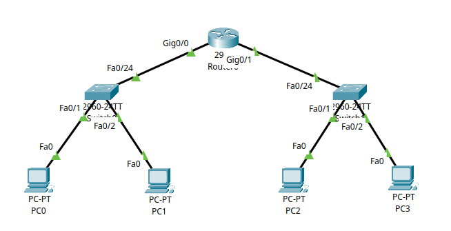

# 5 – Understanding ARP in Cisco Packet Tracer

This tutorial builds upon [**Tutorial 4 – Inter-VLAN Routing**](../cisco/tutorial-series/tutorial4) and focuses on a key Layer 2 concept: the **Address Resolution Protocol (ARP)**. ARP is essential for devices to communicate within a local network by resolving IP addresses to MAC addresses.

---

## Part 1 – What is ARP?

When a device wants to communicate with another on the same network, it needs to know the MAC address associated with the destination IP. If it doesn’t know it, the device sends out an **ARP Request** asking, “Who has this IP?” The device with the matching IP replies with an **ARP Reply** containing its MAC address.

This process is automatic and often hidden behind the scenes – but we can observe it directly using Packet Tracer.

---

## Part 2 – Use the Existing Network

We will use the network built in **Tutorial 4**. You should have:

* **PC1 and PC2** in VLAN 10 (Subnet `192.168.10.0/24`)
* **PC3 and PC4** in VLAN 20 (Subnet `192.168.20.0/24`)
* A router (Router0) configured with:

  * `Gig0/0` → `192.168.10.1`
  * `Gig0/1` → `192.168.20.1`

Ensure all PCs have their IP settings configured and can ping each other as per the end of Tutorial 4.



---

## Part 3 – Checking the ARP Table

### Step 3.1 – Viewing ARP on a PC

To check the ARP table on a PC:

1. Click on **PC1**
2. Go to **Desktop** → **Command Prompt**
3. Type the following:

   ```bash
   arp -a
   ```

   

This will show the current ARP table. If the table is empty, no local communication has happened yet.

> **Screenshot Placeholder:**
> *Insert screenshot of empty ARP table on PC1.*

---

### Step 3.2 – Triggering ARP with a Ping

Now let’s populate the ARP table:

1. From **PC1**, ping **PC2**:

   ```bash
   ping 192.168.10.12
   ```

   

2. Then run:

   ```bash
   arp -a
   ```

   

You’ll now see the MAC address of PC2 in the table, mapped to its IP.

You can repeat this process on **PC3** and **PC4**, or try pinging across VLANs (e.g., PC1 → PC3) to see the **router's MAC** appear in the table instead of the end device’s MAC.

---

## Part 4 – ARP Table on the Router

You can also view ARP entries on the router:

1. Click on **Router0**

2. Go to the **CLI** tab

3. Enter privileged mode:

   ```bash
   enable
   ```

4. Run:

   ```bash
   show ip arp
   ```


This will display the ARP table of the router, including connected devices.

---

## Part 5 – Clearing the ARP Table

### Step 5.1 – On a PC

To clear the ARP cache on a PC in Packet Tracer:

1. Click on **PC1**
2. Go to **Desktop** → **Command Prompt**
3. Type:

   ```bash
   arp -d
   ```

   

Then check with:

```bash
arp -a
```


### Step 5.2 – On the Router

1. On **Router0**, you can clear entries individually:

   ```bash
   clear arp-cache
   ```

   

Confirm by running `show ip arp` again.


---

## Part 6 – Observing ARP in Simulation Mode

1. Switch Packet Tracer to **Simulation Mode** (bottom right corner).
2. From **PC1**, **ping PC2**.
3. Step through the simulation using **Capture / Forward**.

> You’ll see:
>
> * An **ARP Request** packet broadcast
> * An **ARP Reply** packet sent back
> * Then the actual **ICMP Echo Request** and **Reply** (ping)


---

## Summary

In this tutorial, you learned:

* What ARP is and how it enables IP-to-MAC resolution
* How to check the ARP table on PCs and routers
* How to clear ARP entries and repopulate them
* How to **visualise ARP packets** in Packet Tracer using Simulation Mode
