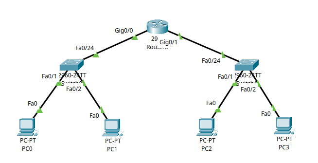
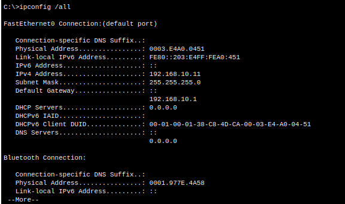
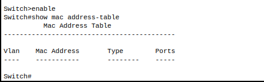
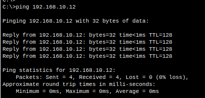
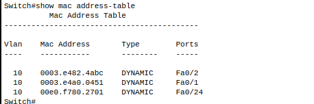
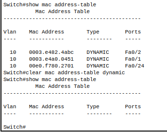

# 6 – Understanding MAC Addresses in Cisco Packet Tracer

This tutorial builds upon [**Tutorial 5 – Understanding ARP**](../tutorial-series/tutorial5) and explores how **MAC (Media Access Control) addresses** work in a switched network. MAC addresses are essential for Ethernet communication and play a key role in how switches forward frames.

---

## Part 1 – What is a MAC Address?

A **MAC address** is a globally unique identifier assigned to a device’s **network interface card (NIC)**. It operates at **Layer 2 (Data Link Layer)** of the OSI model and is used to deliver Ethernet frames within a local network segment.

MAC addresses are usually displayed in hexadecimal, like:

```bash
00:0C:29:3E:1B:72
```

They are used by switches to identify which device is connected to which port.

```{admonition} Key Concept
:class: tip
MAC addresses are permanent hardware identifiers, unlike IP addresses which can change. Switches use MAC addresses to build forwarding tables and reduce unnecessary broadcast traffic.
```

---

## Part 2 – Use the Existing Network

We’ll use the same network from **Tutorial 4 and 5**, which includes:

* **PC0 and PC1** in VLAN 10 (`192.168.10.0/24`)
* **PC2 and PC3** in VLAN 20 (`192.168.20.0/24`)
* Two switches: **Switch0** and **Switch1**
* A router with the following configuration:

  * `Gig0/0` → `192.168.10.1`
  * `Gig0/1` → `192.168.20.1`

Ensure all PCs are configured and can ping each other.



---

## Part 3 – Viewing MAC Addresses on End Devices

Every NIC has a MAC address. Let’s view them from the PC side.

### Step 3.1 – View PC1’s MAC Address

1. Click on **PC0**
2. Go to **Desktop** → **Command Prompt**
3. Type:

   ```bash
   ipconfig /all
   ```

   

The **Physical Address** listed is PC1’s MAC address.

Repeat this process on **PC2**, **PC3**, and **PC4** to confirm each has a unique MAC.

```{admonition} Note
:class: note
MAC addresses are unique per interface. If a device has multiple NICs, each will have a different MAC address.
```

---

## Part 4 – Switch MAC Address Learning

Switches **learn** which MAC address is connected to which port by monitoring the **source address** of incoming Ethernet frames. This allows them to build a **MAC address table** to forward traffic only to the appropriate destination port.

---

### Step 4.1 – Check the MAC Address Table

Let’s see if Switch0 has learned any MAC addresses.

1. Click on **Switch0**

2. Go to the **CLI** tab

3. Enter privileged EXEC mode:

   ```bash
   enable
   ```

4. View the table:

   ```bash
   show mac address-table
   ```

   

If the table is empty, that means no frames have been seen yet.

---

### Step 4.2 – Trigger MAC Learning

We’ll now generate some traffic so the switch can learn MAC addresses.

1. From **PC0**, ping **PC1**:

   ```bash
   ping 192.168.10.12
   ```

   

2. Return to **Switch0** and re-run:

   ```bash
   show mac address-table
   ```

   

You should now see MAC addresses listed with associated switch ports.

You can repeat the same process for **Switch1** by pinging from **PC3** to **PC4**.

```{admonition} Tip
:class: tip
The MAC address table updates dynamically. When the switch sees a new MAC on a port, it adds it. If the device moves to another port, the table will update accordingly.
```

---

## Part 5 – Clearing the MAC Address Table

Switches age out unused MAC entries, but you can clear them manually to test learning behaviour.

### Step 5.1 – On Switch0

1. Enter privileged mode:

   ```bash
   enable
   ```

2. Clear dynamic entries:

   ```bash
   clear mac address-table dynamic
   ```

3. Confirm the table is empty:

   ```bash
   show mac address-table
   ```

   

---

## Part 6 – Observe MAC Learning in Simulation Mode

You can observe MAC learning in real time using Packet Tracer’s **Simulation Mode**.

### Step 6.1 – Start the Ping

1. Switch to **Simulation Mode** (bottom right corner)

2. From **PC0**, open the **Command Prompt** and type:

   ```bash
   ping 192.168.10.12
   ```

3. Press the **"Capture / Forward"** button repeatedly to step through the simulation.

You’ll see:

* An Ethernet frame from PC0
* The switch learning PC0’s MAC on the inbound port
* The frame being forwarded only to the correct destination port

```{admonition} Tip
:class: tip
Only the **first frame** is broadcast if the switch hasn’t learned the destination MAC. Once both MACs are in the table, further communication is direct and efficient. This is also why the first ping may take longer or fail if the switch hasn't learned the MAC addresses yet.
```

---

## Summary

In this tutorial, you:

* Learned what MAC addresses are and how to view them on PCs
* Observed how switches dynamically build MAC address tables
* Used the `show mac address-table` command to verify learning
* Cleared the MAC table and confirmed it repopulates via ping
* Used Simulation Mode to visualise MAC address learning
