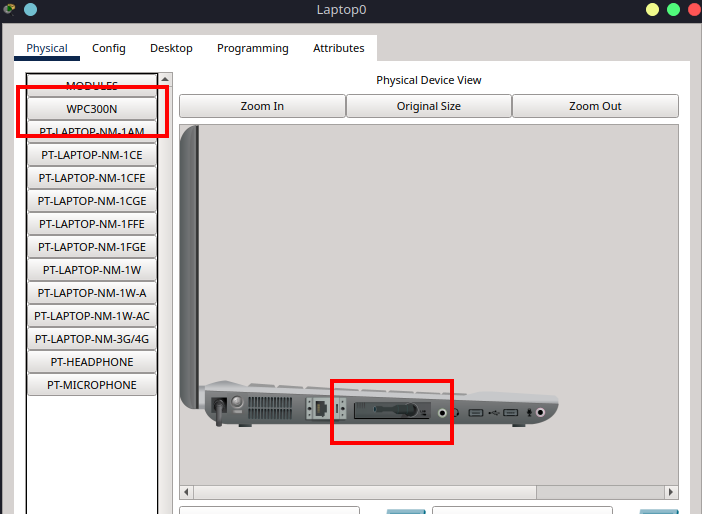

# 7 – Setting Up a Wireless Network in Packet Tracer

This tutorial is the fifth in our Cisco Packet Tracer series, and it introduces **wireless networking** using the **WRT300N wireless router**. We’ll walk through setting up a **Wi-Fi network**, connecting devices wirelessly and via cable, and testing network connectivity.

Find the CISCO pkt files in the repo -

[](https://github.com/breezy-codes/CISCO-Packet-Tracer-Files)

## Creating a Simple Wireless Network with Cisco Packet Tracer

In this tutorial, you will:

* Configure a **WRT300N wireless router**
* Connect two **laptops wirelessly**
* Connect a **desktop PC via Ethernet**
* Test connectivity using **ping commands**

This setup mimics a small home or office wireless network, helping you understand how wireless connectivity works in a practical scenario.

---

## Part 1 – Understanding the Topology

The network consists of:

* A **wireless router** that acts as both switch and DHCP server
* Two **laptops** that connect via Wi-Fi
* One **desktop PC** connected via Ethernet

```bash
         ~ ~ ~ ~ ~ ~ ~ ~      ~ ~ ~ ~ ~ ~ ~ ~
        ~   LAPTOP0    ~    ~   LAPTOP1    ~
         ~ ~ ~ ~ ~ ~ ~ ~      ~ ~ ~ ~ ~ ~ ~ ~
              |                     |
              |     (Wireless)      |
              +---------+-----------+
                        |
                     WRT300N
                        |
                        | (Wired)
                      PC0
```

---

## Part 2 – Device Placement and Cabling

### Step 2.1 – Place Devices on the Workspace

From the **Wireless Devices** and **End Devices** section in Packet Tracer:

* Place a **WRT300N wireless router**
* Add **Laptop0** and **Laptop1**
* Add a **generic PC** (PC0)

Position your devices so the laptops are on either side of the router and PC0 is directly beneath, indicating a wired connection.

---

### Step 2.2 – Connect PC0 to WRT300N

Use a **Copper Straight-Through** cable:

* Connect **PC0’s FastEthernet0** to **WRT300N’s Ethernet1**

No cabling is needed for the laptops, they will connect wirelessly.


---

## Part 3 – Configure the Wireless Router

The **WRT300N** is both a DHCP server and wireless access point. We'll set up both its **wired LAN interface** and **wireless configuration**.

### Step 3.1 – Set SSID

1. Click on the **WRT300N router**.
2. Go to the **GUI tab**.
3. Under **Wireless**:

   * **Network Mode**: Mixed
   * **Network Name (SSID)**: `MyWiFi`
   * **Channel**: Leave default
   * **SSID Broadcast**: Enabled


```{admonition} Note
:class: note
A later tutorial will cover advanced wireless settings like channel selection and security protocols.
```

---

### Step 3.2 – Verify DHCP Settings

1. Still in the **GUI tab**, go to **Setup > Basic Setup**.
2. Confirm **DHCP Server** is **Enabled**.
3. Starting IP Address can remain default (e.g., `192.168.0.100`).


---

## Part 4 – Configure Laptops to Connect Wirelessly

Before connecting to Wi-Fi, each laptop needs to have a **wireless network adapter** installed.

### 4.1 Turn off the Laptop

1. Click on **Laptop0** (repeat later for Laptop1).
2. Go to the **Physical** tab.
3. On the laptop, click the **power button** to turn off the device (the green light will go off).


### 4.2 Replace the Wireless Module

1. In the **Modules** list, find and drag the **WPC300N** module into the **empty network slot** on the right.
2. Remove any existing module (like FastEthernet) if needed to make space.
3. Once the WPC300N is installed, click the **power button** again to turn the laptop back on.



### 4.3 Connect to Wireless Network

Now that the wireless card is installed:

1. Go to the **Desktop** tab → **PC Wireless**.
2. You should see a list of available networks.
3. Click **Connect** next to `MyWiFi`.


After connecting, navigate to **IP Configuration** and confirm the laptop received an IP via DHCP (e.g., `192.168.0.100`).


---

```{admonition} Tip
:class: tip
If the SSID doesn’t appear, click the **“Refresh”** button in the PC Wireless tab. Make sure the router is powered on and SSID broadcast is enabled.
```

Repeat these steps for **Laptop1**.

---

### Step 4.4 – PC0 IP Configuration

1. Click on **PC0**.
2. Go to **Desktop > IP Configuration**.
3. Select **DHCP** instead of static mode. You should receive an IP like `192.168.0.100` or similar.


---

## Part 5 – Verifying Network Connectivity

We’ll test connectivity between devices using the `ping` command.

---

### Step 5.1 – Check IPs of Each Device

Make sure each device has an IP from the router:

```{admonition} Important
:class: warning
Your IP addresses may vary slightly based on DHCP assignments, but they should be in the same subnet (e.g., `192.168.0.x`). So make sure you are using the correct IPs for your devices.
```

| Device  | Connection | IP Address    | Gateway     |
| ------- | ---------- | ------------- | ----------- |
| Laptop0 | Wireless   | 192.168.0.100 | 192.168.0.1 |
| Laptop1 | Wireless   | 192.168.0.103 | 192.168.0.1 |
| PC0     | Wired      | 192.168.0.104 | 192.168.0.1 |

Mine ended up being like the above, so what I did was add the IP addresses as text into packet tracer, so I could see them easily.


---

### Step 5.2 – Test Wireless-to-Wired Connectivity

From **Laptop0**, open the **Command Prompt**:

```bash
ping 192.168.0.104
```

You should see a successful reply from PC0.


---

### Step 5.3 – Test Wireless-to-Wireless Connectivity

On **Laptop1**, ping **Laptop0**:

```bash
ping 192.168.0.100
```

Both devices should communicate successfully.


---

### Step 5.4 – Test All Devices

Finally, go to **PC0** and ping both laptops:

```bash
ping 192.168.0.100
ping 192.168.0.103
```


If all responses are successful, your wireless network is functioning as expected.

---

```{admonition} Troubleshooting
:class: warning
If pings fail:
* Ensure the laptops connected to the correct wireless network
* Re-check DHCP assignments in the router and end devices
```

---

## Summary

In this tutorial, you learned to:

* Configure a **wireless router (WRT300N)** with DHCP
* Connect laptops **wirelessly** using the PC Wireless utility
* Connect a **wired PC** to the router using Ethernet
* **Verify connectivity** using ping tests between wireless and wired devices

This setup introduces the basics of Wi-Fi networking and prepares you for future labs involving mobile devices, wireless encryption types, and wireless security in enterprise networks.
