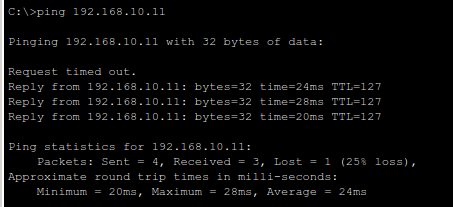

# 8 - How to Add a Wireless Access Point to a Network

This tutorial builds upon the network designed in [Tutorial 5](../tutorial-series/tutorial5), where we implemented inter-VLAN routing using trunk links and subinterfaces. In this lesson, we'll integrate a **wireless access point** into that existing network to support **wireless clients** without introducing a new routing layer.

We'll demonstrate how to add and configure an **AccessPoint-PT**, attach it to an existing switch, and connect a wireless laptop that can communicate with the rest of the VLAN.

---

## Objectives

* Use an **AccessPoint-PT** instead of a wireless router
* Extend **Department B (VLAN 20)** to include wireless devices
* Configure wireless hardware manually in Cisco Packet Tracer
* Assign static IPs to wireless clients
* Verify **intra-VLAN** and **inter-VLAN** connectivity

---

## Part 1 – Base Topology

We will continue using the existing network from **Tutorial 5**. The topology includes:

* **Switch0** and **Switch1** connected to a router (`Router0`) using trunk ports
* **PC0** and **PC1** in VLAN 10
* **PC2** and **PC3** in VLAN 20


Our goal is to connect a wireless laptop to **Switch1** (VLAN 20) using an access point.

---

## Part 2 – Adding the Access Point

### Step 2.1 – Place the Access Point

1. Go to **Network Devices > Wireless Devices**.
2. Drag and drop an **AccessPoint-PT** onto the workspace.


### Step 2.2 – Add a FastEthernet Interface

By default, AccessPoint-PT does not have a wired Ethernet port, so we need to modify it:

1. Click on the **AccessPoint-PT**.
2. Navigate to the **Physical tab**.
3. Click the **power switch** to turn off the device.
   
4. Remove the existing module (if any).
5. Install the **PT-REPEATER-NM-1CFE** module into the expansion slot.
   
6. Turn the device back on using the power switch.

### Step 2.3 – Connect Access Point to the Network

1. Use a **Copper Straight-Through** cable.
2. Connect the **Access Point's FastEthernet0** port to **Switch1 fa0/23**.

This links the Access Point directly to VLAN 20, where PC2 and PC3 are already connected. If you followed the tutorial 5, then this port should already be configured with the correct VLAN settings.


---

## Part 3 – Add and Configure the Wireless Laptop

### Step 3.1 – Add the Laptop

1. Go to **End Devices**.
2. Drag and place a **Laptop** onto the workspace.

### Step 3.2 – Install Wireless Adapter

1. Click the Laptop.
2. Go to the **Physical tab**.
3. Power off the device.
   
4. Remove the existing FastEthernet module (if present).
5. Add a **WPC300N** wireless card.
   
6. Power the laptop back on.

### Step 3.3 – Connect to Wireless Network

1. Open the **Desktop tab**.
2. Go to **PC Wireless**.
3. Click **Connect** to the SSID broadcasted by the Access Point.


---

## Part 4 – Assign Static IP to Wireless Laptop

Because we are not using DHCP in this tutorial, assign the IP manually:

1. Go to the **Desktop > IP Configuration** on the laptop.
2. Enter the following values:

* **IP Address**: `192.168.20.15`
* **Subnet Mask**: `255.255.255.0`
* **Default Gateway**: `192.168.20.1`

This configuration places the laptop in the same subnet and VLAN as PC2 and PC3.


Your network should now look like this:


---

## Part 5 – Verifying Wireless Connectivity

### Step 5.1 – Ping a Wired Host in VLAN 20

From the **Laptop**, open **Command Prompt** and type:

```bash
ping 192.168.20.14
```

> This pings PC3. If successful, the laptop is correctly integrated into VLAN 20.


### Step 5.2 – Ping a Host in VLAN 10

Still on the Laptop, ping a host in another VLAN (e.g., PC0):

```bash
ping 192.168.10.11
```

> If this succeeds, the router-on-a-stick configuration is working correctly and routing between VLANs.



---

## Summary

In this tutorial, you:

* Added an **AccessPoint-PT** to an existing VLAN-based network
* Installed a FastEthernet port into the access point to connect it to a switch
* Configured a **wireless laptop** to join the VLAN and communicate with other devices
* Verified both **intra-VLAN** and **inter-VLAN** connectivity

This setup demonstrates how to extend an enterprise VLAN structure to support wireless clients without compromising VLAN isolation or needing extra routers.
