# 9 - Configuring Static Routing in Cisco Packet Tracer

This tutorial is the nineth in our Cisco Packet Tracer series and focuses on **static routing**, a foundational technique for routing traffic between networks. Unlike RIP, where routers exchange routing tables automatically, static routes must be manually defined on each router, giving you full control over path selection.

We’ll build a three-router network, each connected to a local switch and two PCs, configure IP addressing, set up RIP on each router, and test connectivity between all endpoints.

---

## Part 1 – Network Topology Overview

This network includes:

* **Three routers (R1, R2, R3)** connected in a linear series
* **Three switches (S1, S2, S3)** – one per router
* **Two PCs per switch** (6 total PCs)

The goal is to enable all PCs to communicate through **manually configured static routes**.

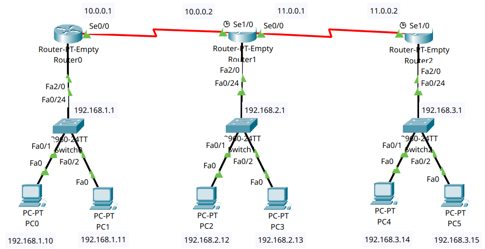

---

## Part 2 – Device Placement and Cabling

### Step 2.1 – Add Devices to the Workspace

Add:

* **3 Routers** (Router-PT-Empty)
* **3 Switches** (2960)
* **6 PCs**

Label:

* Routers: **R0**, **R1**, **R2**
* Switches: **S0**, **S1**, **S2**
* PCs: **PC0–PC5**

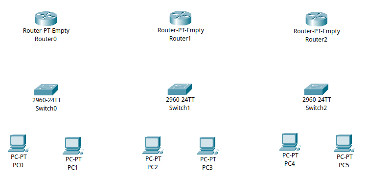

### Step 2.2 – Add Network Modules to Routers

For this topology, use **Router-PT-Empty** devices. Each router needs **two Serial** and **two FastEthernet** interfaces to support all required connections.

```{admonition} Note
:class: note
We will only be using one serial and one FastEthernet interface per router for this tutorial, but the additional interfaces will allow for future expansion in subequent tutorials.
```

Follow these steps for **R0**, **R1**, and **R2**:

1. Click the router to open its configuration window.
2. Go to the **Physical** tab.
3. Click the **power button** to turn off the router (the green light will go out).
   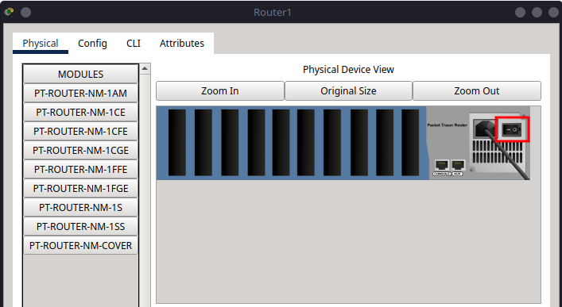
4. In the module area, locate **PT-ROUTER-NM-1S** (Serial Port) and **PT-ROUTER-NM-1CFE** (FastEthernet).
5. Drag and insert **two** PT-ROUTER-NM-1S modules into the first two empty slots (from right to left).
   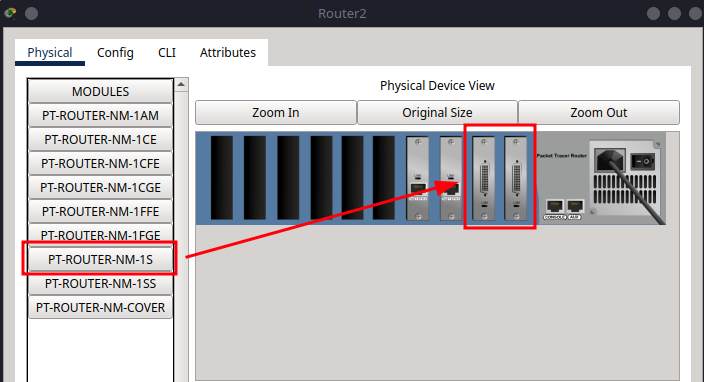
6. Drag and insert **two** PT-ROUTER-NM-1CFE modules into the next two empty slots.
   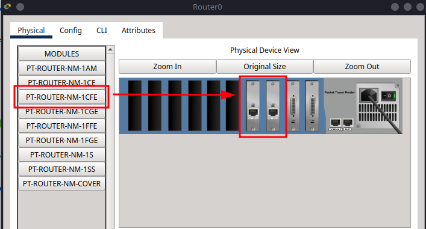
7. Click the **power button** again to turn the router back on.
   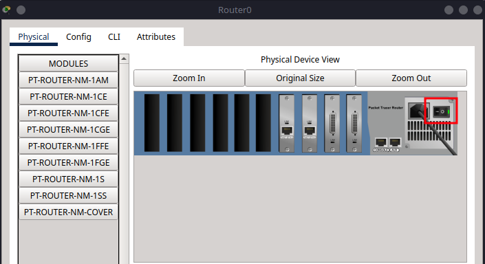

### Step 2.3 – Cabling

#### **Copper Straight-Through**

| From | To | Port/Interface |
| ---- | -- | -------------- |
| PC0  | S1 | fa0/1          |
| PC1  | S1 | fa0/2          |
| S1   | R0 | fa0/24 → fa2/0 |
| PC2  | S2 | fa0/1          |
| PC3  | S2 | fa0/2          |
| S2   | R1 | fa0/24 → fa2/0 |
| PC4  | S3 | fa0/1          |
| PC5  | S3 | fa0/2          |
| S3   | R2 | fa0/24 → fa2/0 |

#### **Serial DTE Connections**

| From | To | Port/Interface |
| ---- | -- | -------------- |
| R0   | R1 | se0/0 ↔ se1/0  |
| R1   | R2 | se0/0 ↔ se1/0  |

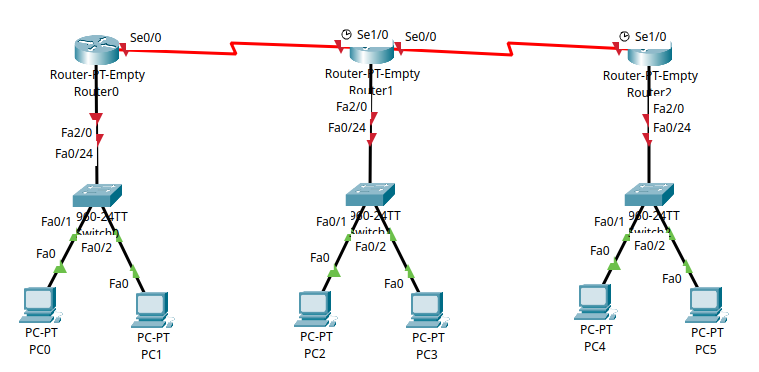

---

## Part 3 – IP Addressing Scheme

Now we will assign IP addresses to all devices, ensuring they can communicate across the network.

### Subnet Allocation

For this tutorial, we will use the following subnets:

| Subnet         | Devices      | Subnet Mask   |
| -------------- | ------------ | ------------- |
| 192.168.1.0/24 | PC0, PC1, R0 | 255.255.255.0 |
| 192.168.2.0/24 | PC2, PC3, R1 | 255.255.255.0 |
| 192.168.3.0/24 | PC4, PC5, R2 | 255.255.255.0 |
| 10.0.0.0/30    | R0 ↔ R1      | 255.0.0.0     |
| 11.0.0.0/30    | R1 ↔ R2      | 255.0.0.0     |

### Step 3.1 – Assign IPs to PCs

Go to **Desktop > IP Configuration** on each PC:

| PC  | IP Address   | Subnet Mask   | Default Gateway |
| --- | ------------ | ------------- | --------------- |
| PC0 | 192.168.1.10 | 255.255.255.0 | 192.168.1.1     |
| PC1 | 192.168.1.11 | 255.255.255.0 | 192.168.1.1     |
| PC2 | 192.168.2.12 | 255.255.255.0 | 192.168.2.1     |
| PC3 | 192.168.2.13 | 255.255.255.0 | 192.168.2.1     |
| PC4 | 192.168.3.14 | 255.255.255.0 | 192.168.3.1     |
| PC5 | 192.168.3.15 | 255.255.255.0 | 192.168.3.1     |

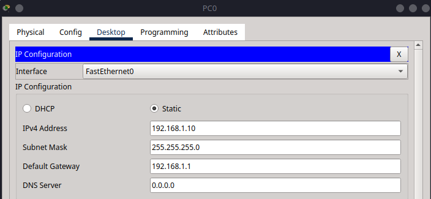

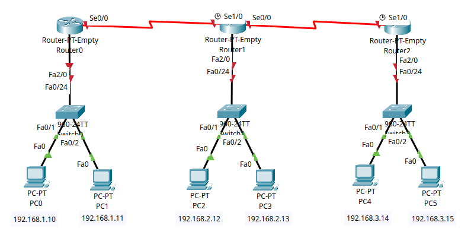

```{admonition} Important
:class: important
Make a save of your Packet Tracer file now before you start configuring the router, we will be using this same set up in the next few tutorials as we explore different routing protocols.
```

---

## Part 4 – Router Configuration

Each router in this network handles two types of connections:

- LAN-side via FastEthernet2/0, connected to a local switch
- WAN-side via Serial interfaces, connected to neighbouring routers
- All routers will be configured with static routing

```{admonition} Note
:class: note
Here the static routing configuration is done manually. For example in R0, we add routes to R1 and R2 via the lines - 

- `ip route 192.168.2.0 255.255.255.0 10.0.0.2`
- `ip route 192.168.3.0 255.255.255.0 10.0.0.2`

This means that R0 will know how to reach the networks of R1 and R2 through the serial link to R1 (10.0.0.2).
```

### Step 4.1 – R0 Configuration

```bash
enable
configure terminal
hostname R0

interface fa2/0
ip address 192.168.1.1 255.255.255.0
no shutdown
exit

interface se0/0
ip address 10.0.0.1 255.0.0.0
clock rate 64000
no shutdown
exit

ip route 192.168.2.0 255.255.255.0 10.0.0.2
ip route 192.168.3.0 255.255.255.0 10.0.0.2
exit

write memory
exit
```


### Step 4.2 – R1 Configuration

```bash
enable
configure terminal
hostname R1

interface fa2/0
ip address 192.168.2.1 255.255.255.0
no shutdown
exit

interface se1/0
ip address 10.0.0.2 255.0.0.0
no shutdown
exit

interface se0/0
ip address 11.0.0.1 255.0.0.0
clock rate 64000
no shutdown
exit

ip route 192.168.1.0 255.255.255.0 10.0.0.1
ip route 192.168.3.0 255.255.255.0 11.0.0.2
exit

write memory
exit
```

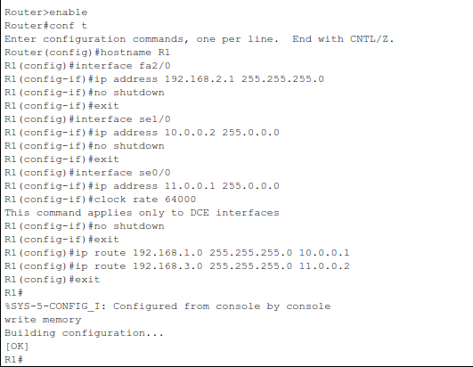

### Step 4.3 – R2 Configuration

```bash
enable
configure terminal
hostname R2

interface fa2/0
ip address 192.168.3.1 255.255.255.0
no shutdown
exit

interface se1/0
ip address 11.0.0.2 255.0.0.0
no shutdown
exit

ip route 192.168.1.0 255.255.255.0 11.0.0.1
ip route 192.168.2.0 255.255.255.0 11.0.0.1
exit

write memory
exit
```

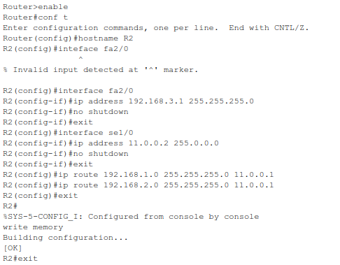

---

## Part 5 – Verification and Testing

### Step 5.1 – Routing Table Check

```bash
show ip route
```

You should see **static routes (`S`)** to remote networks.

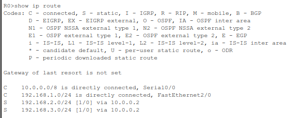

### Step 5.2 – Test Connectivity

From **PC0**, test:

```bash
ping 192.168.1.11
ping 192.168.2.12
ping 192.168.3.14
```

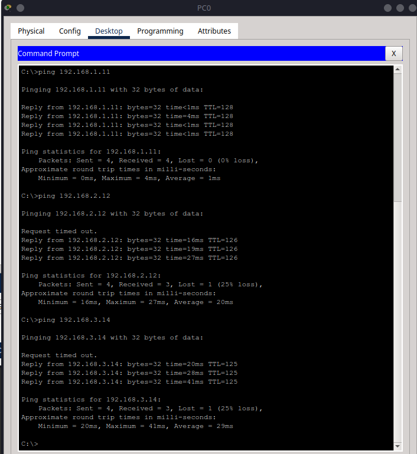

From **PC3**, test:

```bash
ping 192.168.3.14
```

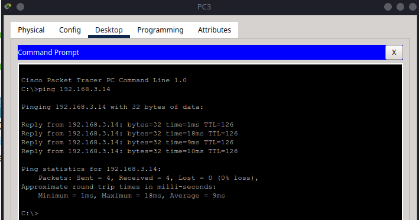

Repeat between any pair of PCs.

---

## Summary

In this tutorial, you:

* Reused a three-router, three-switch network
* Assigned IPs to all devices
* Manually configured static routes
* Verified end-to-end connectivity with `ping`

The next tutorial will build on this foundation by introducing **RIP routing**, allowing routers to automatically exchange routing information and dynamically adjust to network changes.
