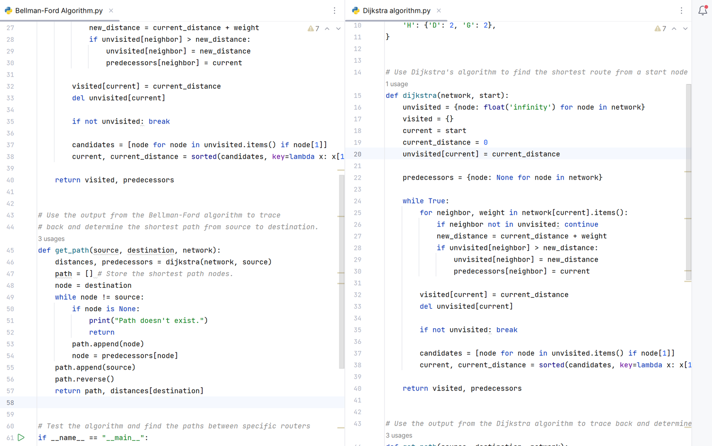

# **Network Routing Algorithms**

These python scripts demonstrate two fundamental network routing algorithms: Bellman-Ford and Dijkstra. Both algorithms are used to find the shortest path in a network of routers, but they operate differently and have distinct use cases. Below are the implementations and explanations for each algorithm.



You can view the program code here:


```{tableofcontents}
```

## Complexity, Advantages, and Disadvantages

### Bellman-Ford Algorithm

**Time Complexity**:

- The time complexity of the Bellman-Ford algorithm is $O(V \cdot E)$, where $V$ is the number of vertices and $E$ is the number of edges.

**Space Complexity**:

- The space complexity is $O(V)$ for storing distances and predecessors.

**Advantages**:

- **Handles Negative Weights**: Bellman-Ford can handle graphs with negative weight edges.
- **Detects Negative Weight Cycles**: It can detect if there is a negative weight cycle in the graph, which Dijkstra's algorithm cannot.

**Disadvantages**:

- **Slower than Dijkstra**: Bellman-Ford is generally slower compared to Dijkstra's algorithm for graphs without negative weights.
- **Inefficiency with Large Graphs**: The algorithm can be inefficient for very large graphs due to its higher time complexity.

### Dijkstra's Algorithm

**Time Complexity**:

- Using a simple array: $O(V^2)$
- Using a priority queue (e.g., binary heap): $O((V + E) \log V)$

**Space Complexity**:

- The space complexity is $O(V)$ for storing distances, predecessors, and the priority queue.

**Advantages**:

- **Efficiency**: Dijkstra's algorithm is faster and more efficient for graphs with non-negative weights.
- **Suitable for Dense Graphs**: When implemented with a priority queue, Dijkstra's algorithm performs well even for dense graphs.

**Disadvantages**:

- **Cannot Handle Negative Weights**: Dijkstra's algorithm cannot handle negative weight edges, as it may produce incorrect results.
- **No Cycle Detection**: It does not detect negative weight cycles in the graph.
