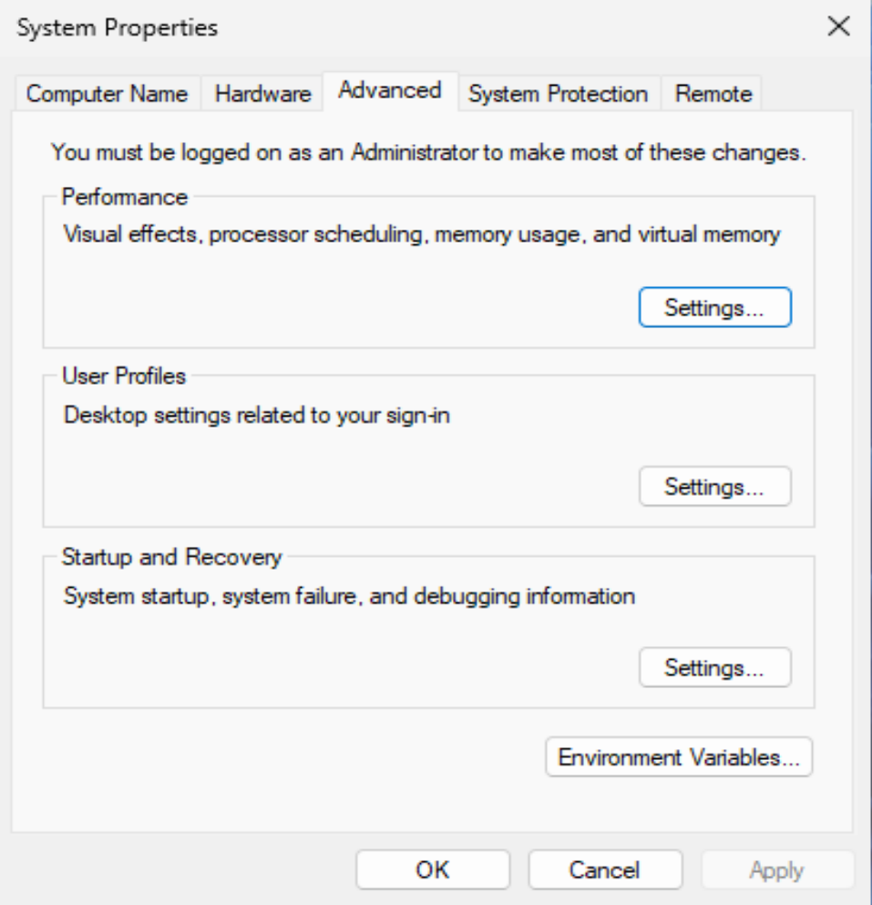
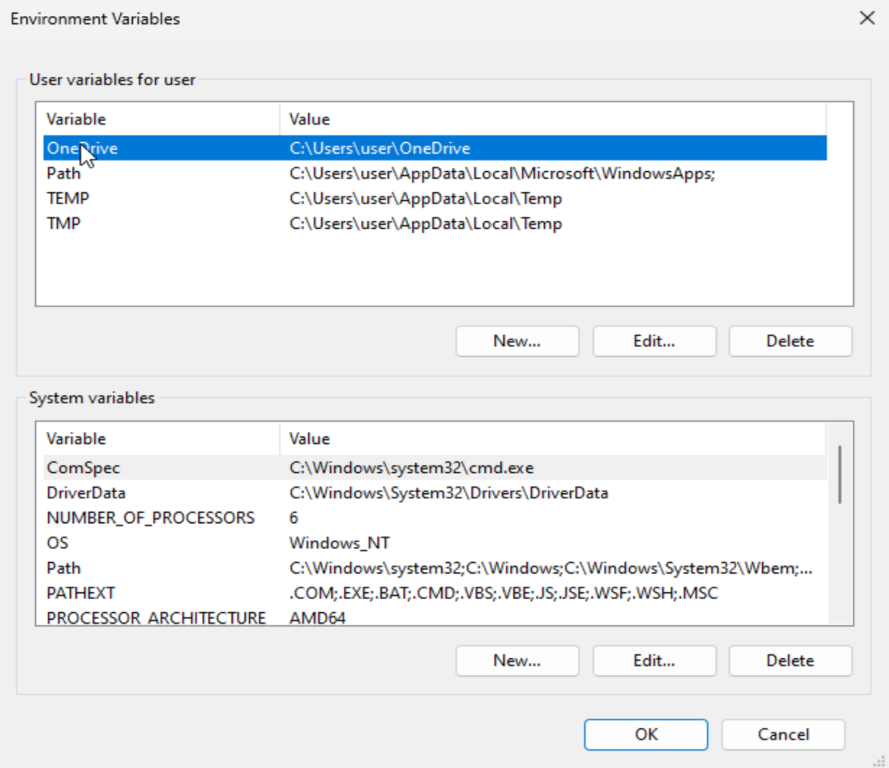
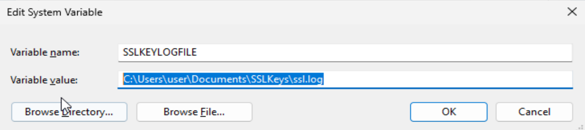
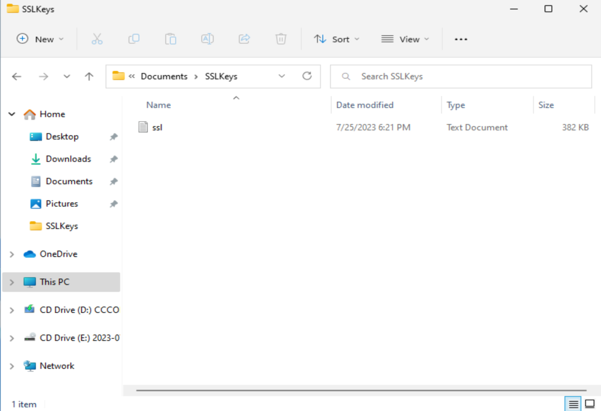
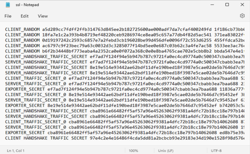
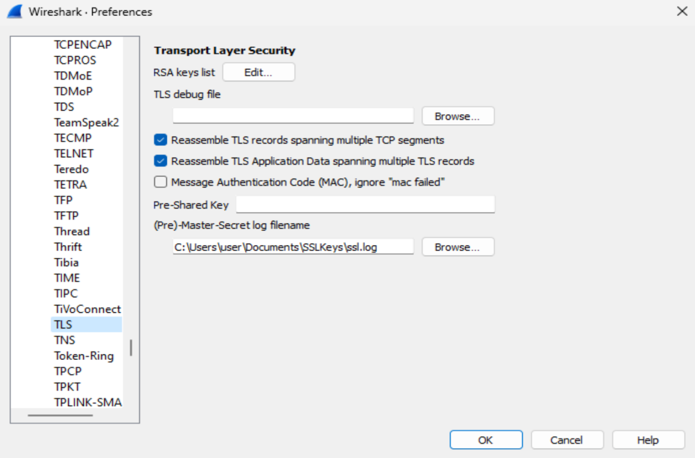

# **Decrypt HTTPS Traffic in Wireshark on Windows**

Wireshark is a handy tool when it comes to exploring network communications by analysing the protocols and packets occurring when accessing a website on the internet. Wireshark can be a powerful tool for network professionals, cybersecurity and students. As a current university student I've been working with Wireshark and wanted to create a tutorial showing you how to decrypt `HTTPS` within Wireshark.

## Lets go through the steps:

### **Step 1**

The first step is to create an environment variable to capture the keys needed for decryption. The first step is to open up control panel and go to system properties.
The window should look like this, an easy way to find it is to just type `environment variables` into the start search menu.
From here you will want to enter into the environment variables box, and this is where you will be creating the SSL key log.

From here, you want to enter a new `SYSTEM VARIABLE`, it has to be a system variable for this to work. Press new and you want to create a new system variable to say the following -

- Variable name - `SSLKEYLOGFILE`
- Variable value - `C:\Users\yourusername\Documents\SSLKeys\ssl.log`

Make sure to change that to be `your own user` in your system, you can also save the key log file to different locations. You just need to be able to access it both to check its working, and to be able to add into Wireshark. It should look something like this-

## **Now you MUST restart your computer for this to work.**

### **Step 2**

Now for step 2, once you've restarted your computer, you need to check if the file is working. If you haven't restarted, you won't find this file. You now need to navigate to where you saved the folder/file.

Which should look something like the above, from there you want to open up this file and check there is actual keys added into it. Which should look something like the following -

### **Step 3**

Now is the fun part, open up Wireshark and we are going to add in this key. You need to navigate to the edit tab up the top and go down to preferences. Within the preferences window, you want to open up protocols and scroll down until you find `TLS`.

From here, in the (Pre)-Master-Secret log filename, you want to press browse and navigate to that `ssl.log` file we created previously. Once this is in Wireshark, all the `HTTPS` traffic will be decrypted. That's it!

## **Final notes**

Once you've created this `ssl.log` file you don't have to do anything again, all the `HTTPS` traffic picked up within Wireshark will be automatically decrypted for you to analyse the information.

Please note, if you move or delete the `ssl.log` you will need to change it/make a new one from the very first step again.

## Watch my tutorial on the process on YouTube

  
  
  
    <iframe src="https://www.youtube.com/embed/iUyT4FJHIV4" style="position: absolute; top: 0; left: 0; width: 100%; height: 100%;" frameborder="0" allow="accelerometer; autoplay; encrypted-media; gyroscope; picture-in-picture" allowfullscreen></iframe>  
  
  

