# Decrypt HTTPS Traffic in Wireshark On Ubuntu Linux

Being able to inspect HTTPS traffic in Wireshark is extremely useful when you're debugging APIs, analysing website behaviour, or learning how network protocols work behind the scenes. This guide walks through how to decrypt HTTPS traffic in Wireshark on Ubuntu using the `SSLKEYLOGFILE` method, no need for certificates or proxy setups.

---

## Part 1: Setting Up the `SSLKEYLOGFILE` Environment Variable

To enable HTTPS decryption, you need to set the `SSLKEYLOGFILE` environment variable so supported browsers can log TLS keys. There are two main ways to do this:

---

### **Method 1 – Temporary (Current Terminal Only)**
<!-- NEED TO GET A SCREENSHOT SHOWING THIS BEING DONE. NAME IT FIG11 -->

Set the environment variable for just your current terminal session. This is quick and doesn't affect other terminals or future sessions.

```bash
export SSLKEYLOGFILE=~/.ssl-key.log
```

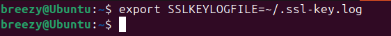

After running this command, any browser launched from this terminal will log TLS keys to `~/.ssl-key.log`. The variable will be unset when you close the terminal.

**Pros:**

- No permanent changes to your system.
- Good for quick, one-off debugging.

**Cons:**

- You must set it every time you open a new terminal.
- Only affects programs launched from that terminal session.

---

### **Method 2 – Permanent (All Future Terminals)**

Add the environment variable to your shell configuration file (e.g., `.bashrc`) so it's set automatically for all future terminal sessions.

```{admonition} Note on bash vs zsh
:class: tip
Here we assume you are using `bash`. If you use `zsh`, replace `.bashrc` with `.zshrc` in the instructions below. It will work the same way.
```

Open your `.bashrc` file:

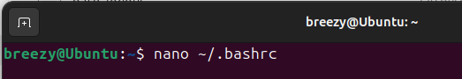

```bash
nano ~/.bashrc
```

Scroll to the bottom and add:

```bash
export SSLKEYLOGFILE=~/.ssl-key.log
```

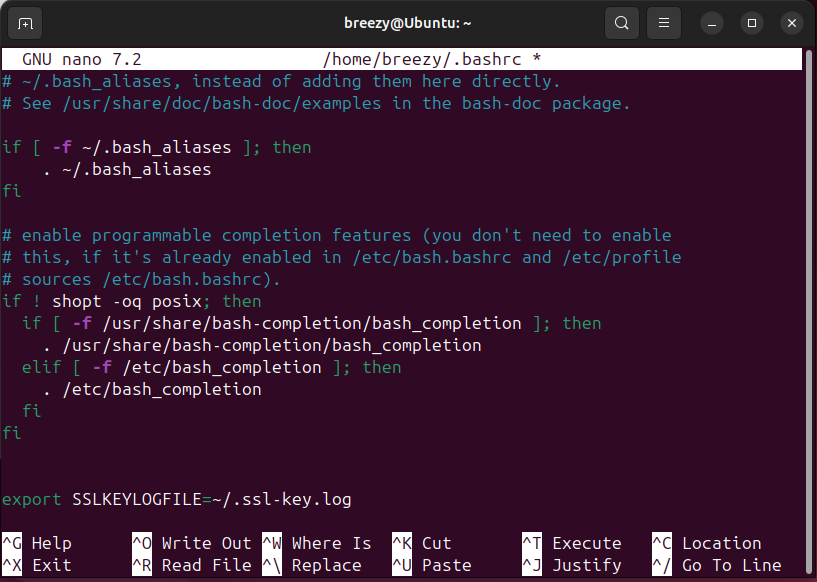

Save and exit (`CTRL + O`, then `CTRL + X`). Then apply the changes with:

```bash
source ~/.bashrc
```

You can confirm it's set by running:

```bash
echo $SSLKEYLOGFILE
```

You should see the correct file path printed.

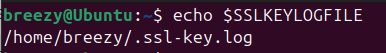

**Pros:**

- Automatically set in every new terminal.
- No need to remember to set it each time.

**Cons:**

- Affects all terminal sessions (may not always be desirable).
- Slightly more setup required.

---

Choose the method that best fits your workflow. For most users, the permanent method is more convenient, but the temporary method is useful for quick tests or if you don't want to modify your shell configuration.

## Part 2: Configuring Your Browser to Log SSL Keys

Now we need a browser that supports TLS key logging. Note that **Firefox on Linux no longer supports this method by default**, so you'll need to use **Chromium or Google Chrome**.

Important: If you're using Chromium or Chrome from **Snap** or **Flatpak**, this likely won’t work, they are sandboxed and cannot write to external files like `~/.ssl-key.log`.

To avoid this, install the `.deb` version of Chrome:

```bash
wget https://dl.google.com/linux/direct/google-chrome-stable_current_amd64.deb
sudo apt install ./google-chrome-stable_current_amd64.deb
```

Once installed, you need to launch Chrome from a terminal so it inherits the environment variable.

- **If you used Method 1 (Temporary):**  
    Before launching Chrome, make sure to set the environment variable again in your current terminal session:

    ```bash
    export SSLKEYLOGFILE=~/.ssl-key.log
    ```

    Then start Chrome:

    ```bash
    google-chrome &
    ```

- **If you used Method 2 (Permanent):**  
    You can simply run:

    ```bash
    google-chrome &
    ```

    The environment variable will already be set in all new terminals.

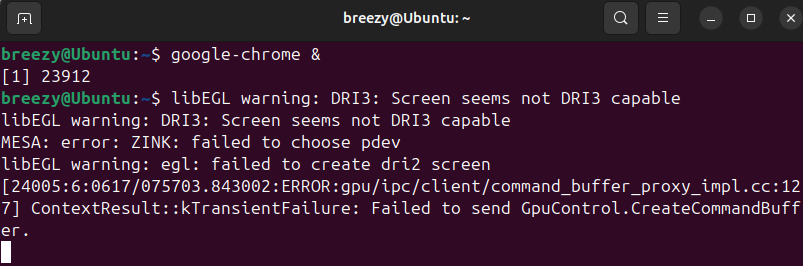

### Important Note on Snap/Flatpak Versions

If you try to use Chromium installed via Snap, you'll likely see an error stating that it couldn't open the SSL key log file.

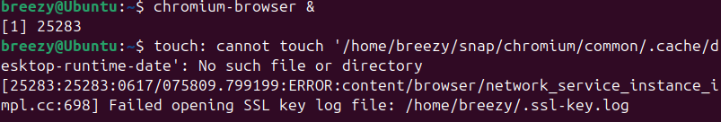

To avoid this, ensure you are using the `.deb` version of Google Chrome as described above. The Snap and Flatpak versions do not support writing to the `SSLKEYLOGFILE` due to sandboxing restrictions.

### Testing the SSL Key Log File

When Chrome is working correctly, visiting a few HTTPS websites will cause the `.ssl-key.log` file to populate. You can check this by running:

```bash
cat ~/.ssl-key.log
```

Or by opening the file in a text editor. You should see lines like this:

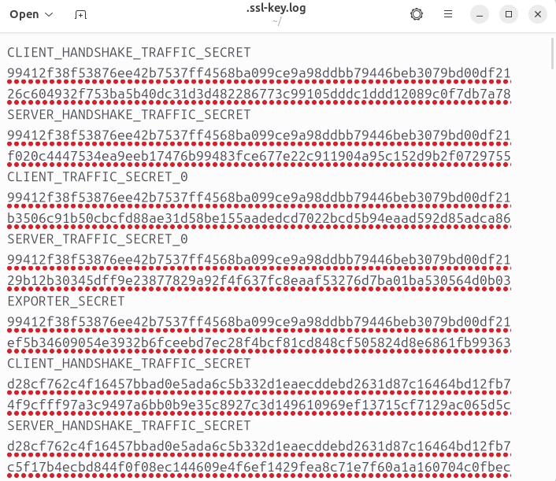

---

## Part 3: Configuring Wireshark to Use the SSL Key Log File

Now we’ll configure Wireshark to use the SSL key log file.

1. Open Wireshark
2. Go to `Edit` → `Preferences`
3. Navigate to `Protocols` → `TLS`
4. Set the **(Pre)-Master-Secret log filename** to (make sure to change to your username):

```bash
/home/breezy/.ssl-key.log
```

If you're using the file browser to locate it, make sure to enable "Show hidden files" so `.ssl-key.log` is visible.

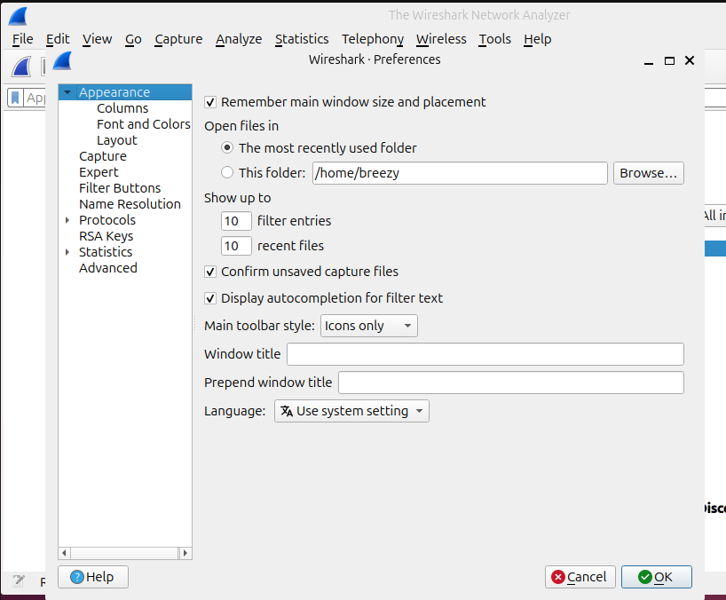

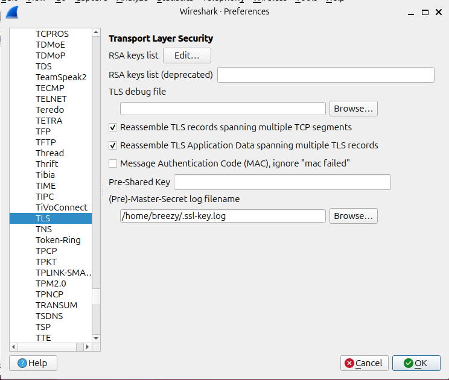

Click **OK** to save the changes.

---

## Part 4: Capturing and Analysing HTTPS Traffic

Now you can begin capturing traffic.

1. Start a capture in Wireshark on your active interface (e.g. `wlan0`, `eth0`)
2. Launch the browser from your terminal:

    ```bash
    google-chrome &
    ```

3. Visit any HTTPS website

If everything is working, Wireshark will automatically decrypt the traffic using the key log file. You should start seeing decrypted HTTPS content.

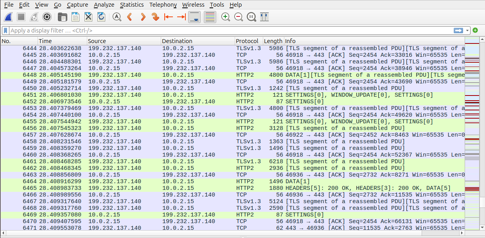

To filter just the decrypted traffic, use the following display filter:

```bash
http2
```

This will show you all HTTP/2 traffic, which is commonly used by modern websites. Here there is some entries for reCAPTCHA and Reddit, demonstrating that the HTTPS traffic is being captured and decrypted successfully.

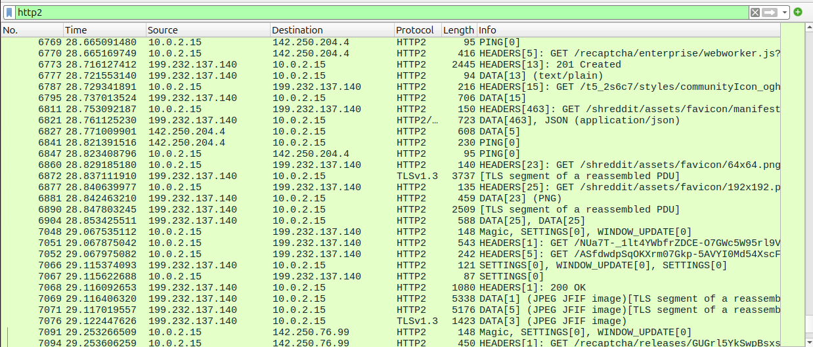

---

## Conclusion

By using the `SSLKEYLOGFILE` method, you can decrypt and inspect HTTPS traffic in Wireshark without the need for proxies or custom certificates. This approach is especially useful for debugging browser-based network activity and analyzing protocols like HTTP/2.

**Key points to remember:**

- You must launch your browser from a terminal session where the `SSLKEYLOGFILE` environment variable is set.
    - If you used the **temporary method**, remember to set the variable each time you open a new terminal.
    - If you used the **permanent method**, the variable will be set automatically in all future terminal sessions.
- This method does **not** work with Snap or Flatpak versions of Chromium or Firefox due to sandboxing restrictions.
- The `.deb` version of Google Chrome is recommended for the most reliable results.

With this setup, you can efficiently capture and decrypt HTTPS traffic for troubleshooting, learning, or protocol analysis on Ubuntu.
