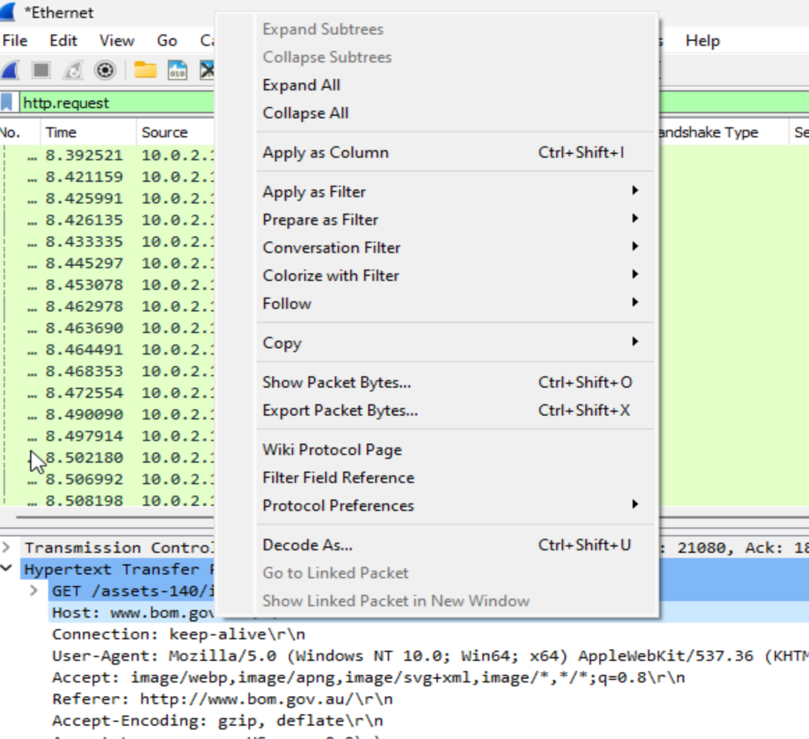
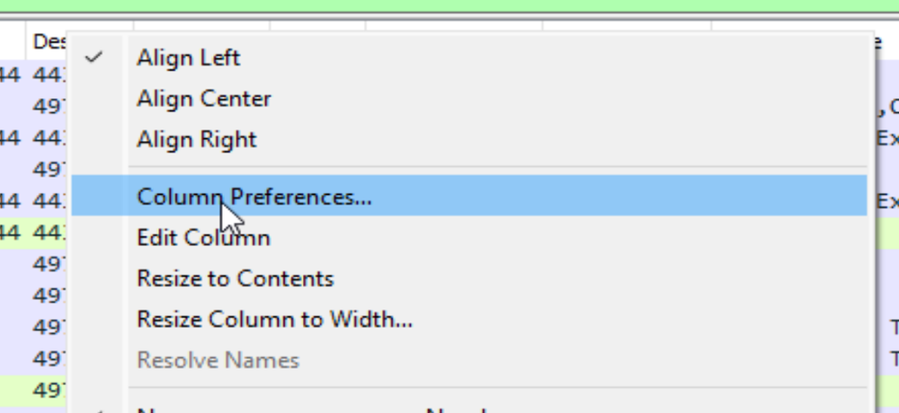
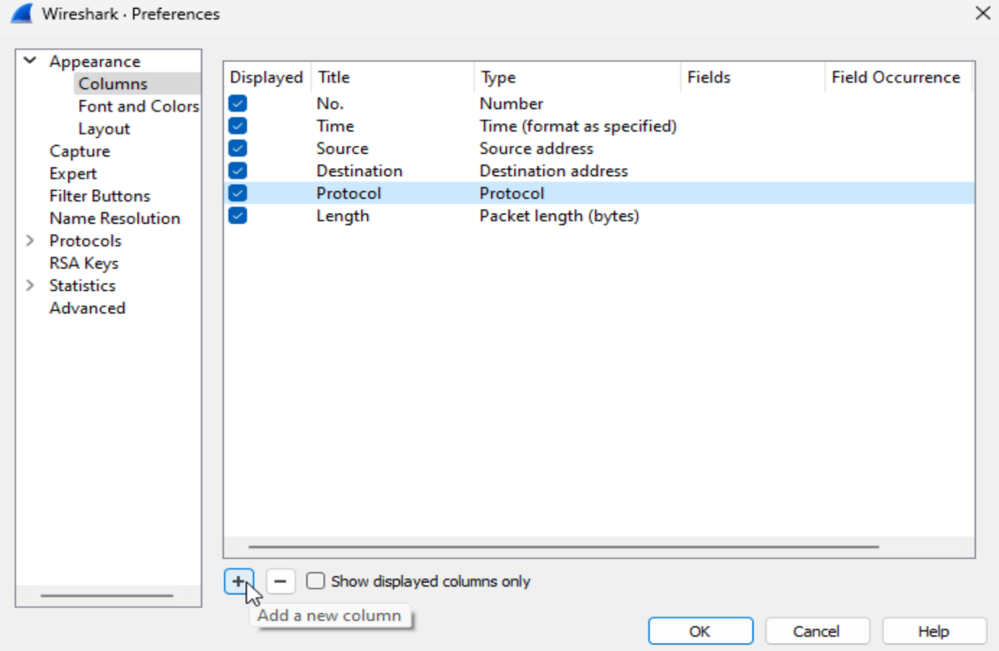
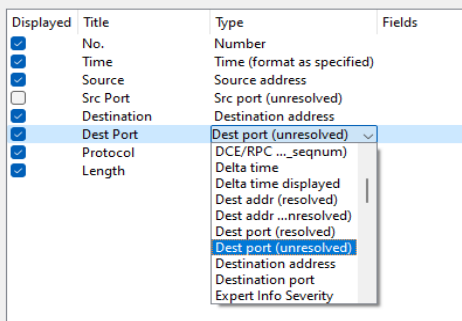
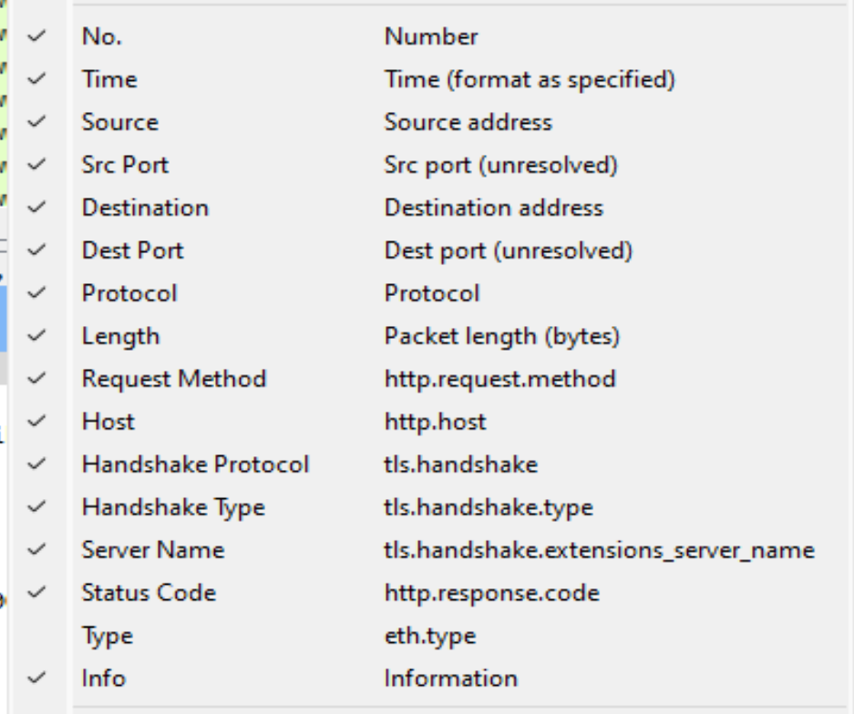

# Wireshark Custom Column Views

Wireshark is a handy tool when it comes to exploring network communications by analysing the protocols and packets occurring when accessing a website on the internet. Wireshark can be a powerful tool for network professionals, cybersecurity and students. As a current university student I have made this tutorial to go over setting up different column views within Wireshark to make it easier to find the information you need.

These columns I go over setting up are mostly for analysing `HTTP` and maybe `HTTPS` if you've set up a decryption key. Here is a link to my other blog post going over how to set up a decryption key for this.

## **The defaults:**

Wireshark by default has the following columns when you first start-

- **No**. -Frame number from the beginning of the `pcap`. The first frame is always 1.
- **Time** - Seconds broken down to the nanosecond from the first frame of the `pcap`. The first frame is always 0.000000.
- **Source** - Source address, commonly an `IPv4`, `IPv6`, or `Ethernet address`.
- **Destination** - Destination address, commonly an `IPv4`, `IPv6`, or `Ethernet address`.
- **Protocol** - Protocol used in the `Ethernet frame`, `IP packet`, or `TCP segment (ARP, DNS, TCP, HTTP, etc.)`.
- **Length** - Length of the frame in bytes.
Depending on your goals this might or might not be beneficial to you. Further down in this tutorial I go over how you can toggle views on or off.

## **Adding views from column preferences:**

The first way to add columns is by right clicking the column title section then selecting column preferences.

From there you will be taken to the following screen where you can customise these settings.

Now to add your first columns, press the plus button to add a new column. There is a variety of options you can select from in here depending on your needs. The two columns I will be adding is the `src port (unresolved)` and the `dest port (unresolved)`.

## **Adding columns from the frame section:**

The second method for adding columns (my preferred) is from the frame section. If you find yourself inspecting the frames for specific information each time, you can add this as a column view instead.

This method allows you to find the specific information, from there you can right click and select "apply as column". You can select the information relevant to your current searches or the typical information you need to find.
For example, I have the host as one of my columns and when I run Wireshark, I can first sort by host and check the `IP address` of the host and go straight to filtering by that `IP address`. Or if I'm analysing the `TLS protocol`, I can quickly see the handshake type that occurred or search by ports.
These are the current filters I am using to analyse `HTTP` and `HTTPS` traffic as well as `TLS` analysis for university currently.

## **How to toggle filters:**

Once you know how to set up these columns you can customise to whatever you are currently working on so that you can search for that information. Once they are set up you can easily toggle the columns on or off by right clicking anywhere on the column titles.

## Watch my tutorial on the process on YouTube

  

    <iframe src="https://www.youtube.com/embed/qamES2CmfSA" style="position: absolute; top: 0; left: 0; width: 100%; height: 100%;" frameborder="0" allow="accelerometer; autoplay; encrypted-media; gyroscope; picture-in-picture" allowfullscreen></iframe>
  

